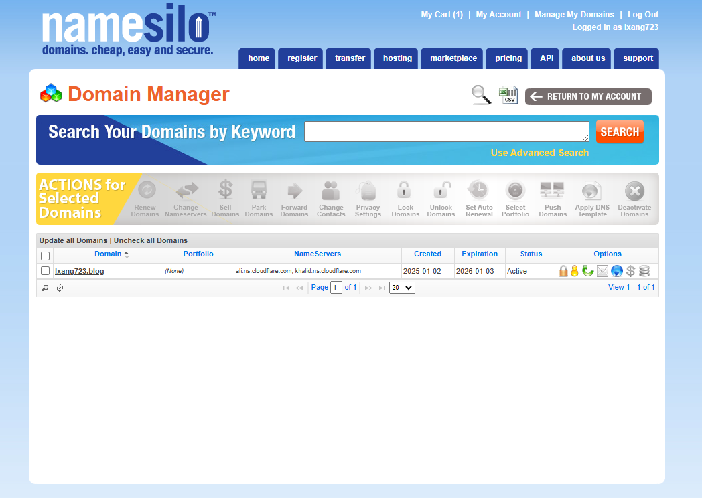
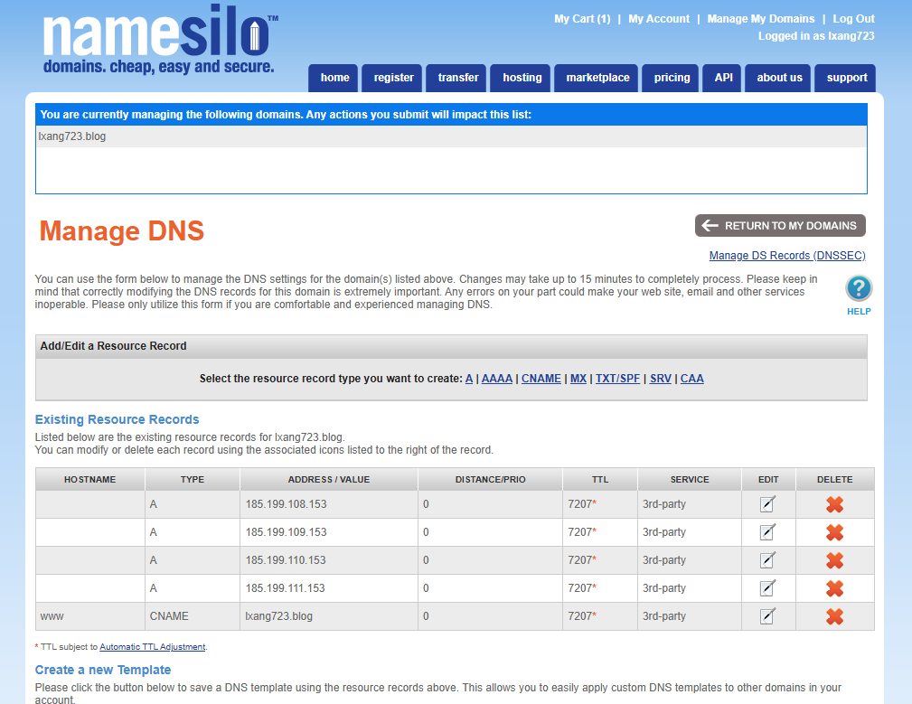
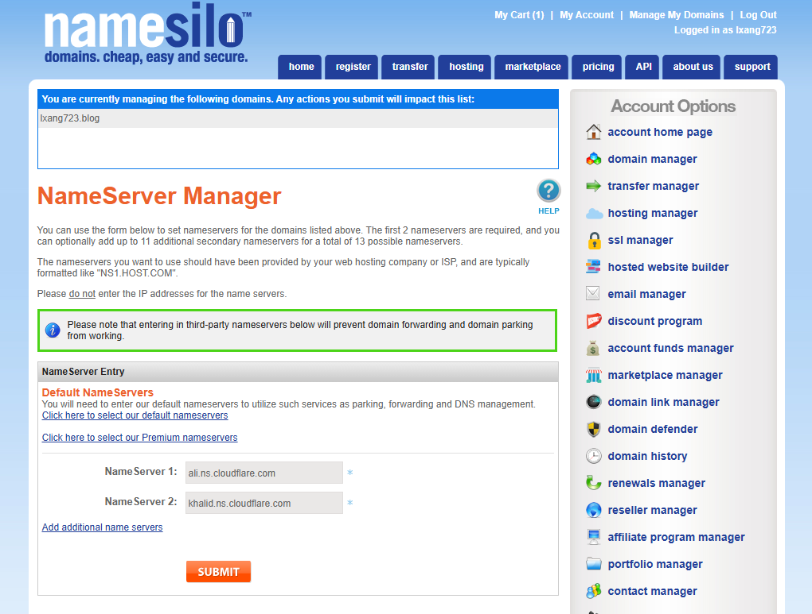
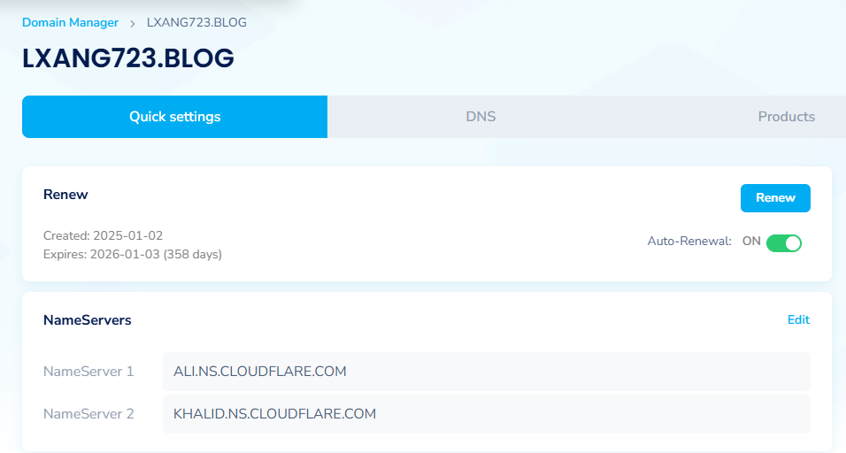
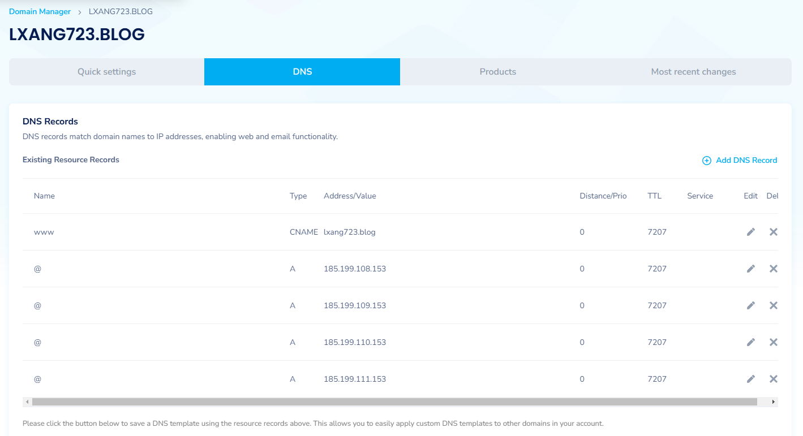
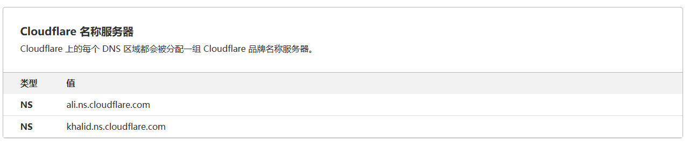
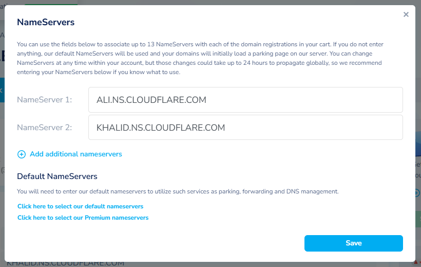

[NameSilo](https://www.namesilo.com/) ：是一家提供域名注册、DNS 托管、隐私保护以及其他相关互联网服务的公司。它因其低价、易于使用的控制面板以及免费的隐私保护而受到许多网站管理员和博客主的青睐。

## 参考链接

- [附优惠码！NameSilo域名购买教程（2025年01月更新）](https://xmmblog.com/namesilo-domain-registration/) 。有优惠码，首次注册购买域名时可享受 1 美元优惠。
- [Github 部署个人网页 | 自定义域名](https://zhuanlan.zhihu.com/p/393050270)  

## 购买域名

NameSilo 不光便宜，而且是可以用支付宝付款的。

### 步骤

- 1. 搜索域名：[https://www.namesilo.com/domain/search-domains](https://www.namesilo.com/domain/search-domains)
    - 也可以使用 Cloudflare 注册域名：[How to register a new domain](https://developers.cloudflare.com/registrar/get-started/register-domain/) 。
    - Cloudflare 的 `.com` 域名的注册价格要比 NameSilo 便宜，而且可以省去使用 Cloudflare 的 DNS 服务时更改域名服务器操作。
- 2. 点击 **蓝色购物车** 按钮，将域名添加到购物车。
- 3. 点击页面右侧的绿色 `Checkout` 付款按钮（或点击右上角购物车图标， View cart），进入购物车 Shopping Cart。
- 4. 点击页面下方的绿色 `Checkout` 按钮，进入付款台。
- 5. 注册账户并填写地址，建议使用谷歌邮箱注册。
- 6. 付款：
  -  **Please select how you would like to pay for this order** 部分，点击 `Add New` 按钮。
  -  **Select Payment Option（选择付款方式）** 选择第四个 `See more`。
  -  选择 **Most popular** 中的 **支付宝** 选项，点击绿色 `Select` 按钮。
  -  勾选 `I accept the NameSilo.com Terms & Conditions` ，点击蓝色 `PAY` 按钮，进入支付宝收银台，完成支付。

## 管理域名

[NameSilo 帮助文档 -> DNS Management Platform](https://www.namesilo.com/support/v2/articles/domain-manager/dns-manager)

### 步骤

- 进入 [Dashboard](https://www.namesilo.com/account/)，左侧栏选择 `Domain Manager`（或点击 **Active Domains** 卡片的 **Manage**），进入域名管理页面。
- 进入 DNS 管理页面。
  - 方式 ① 点击 **蓝色地球图标**，进入 **Manage DNS** 页面。  
  - 方式 ② 或者直接点击你的域名（ Domain 列下，带下划线）。（推荐，页面 UI 较新）

这里主要说明 DNS 管理页面（DNS 记录管理）和 NameServer 管理页面（域名服务器管理）。

### 方式 ① 页面样式

#### 1. Domain Manager 页面

点击 **Options** 列的 **蓝色地球图标** 进入 **Manage DNS** 页面。



#### 2. Manage DNS 页面



#### 3. NameServer Manager 页面

在 **Domain Manager** 页面内，勾选域名行前面的复选框，点击黄色部分 **ACTIONS for Selected Domains** 中的 **Chang NameServers** ，可进入 **NameServer Manager** 页面。

[NameSilo -> Updating Name Servers](https://www.namesilo.com/support/v2/articles/domain-manager/nameserver-manager)

::: info Note
Go to the Domain Manager page within your account  
Check the box next to the domain(s) you would like to update  
Select the "Change Nameservers" icon from the top of the domain list in the "ACTIONS for Selected Domains" section  
Add/Update your name servers in the "NameServer Entry" box  
:::



### 方式 ② 页面样式

#### 1. Quick settings 标签页

可管理 NameServer。  



#### 2. DNS 标签页



## 添加 DNS 记录

先了解一下 **A 记录**与 **CNAME 记录**。

[什么是 DNS 记录？](https://www.cloudflare.com/zh-cn/learning/dns/dns-records/)  
[什么是 DNS A记录？](https://www.cloudflare.com/zh-cn/learning/dns/dns-records/dns-a-record/)  
[什么是 DNS CNAME 记录？](https://www.cloudflare.com/zh-cn/learning/dns/dns-records/dns-cname-record/)

**A 记录**：是直接将域名映射到一个 IP 地址。  
**CNAME 记录**：是将一个域名映射到另一个域名，而不是直接映射到 IP 地址。  
**Apex 域**：也叫 裸域 或 根域，指的是一个域名的基础部分，即不包含任何子域的域名。  
根域用 A 记录，而子域名用 CNAME 记录。  
CNAME 记录只能有一个指向目标，不能设置多个。

::: info Note
通常，当站点具有子域（例如 blog.example.com 或 shop.example.com）时，这些子域将具有指向根域 (example.com) 的 CNAME 记录（需要你手动添加或设置 CNAME 记录）。这样，如果主机的 IP 发生更改，则仅需要更新根域的 DNS A 记录，这样所有 CNAME 记录都会跟随对根所做的任何更改。
:::

我购买的域名为 `lxang723.blog`。  

我想通过 `lxang723.blog` (根域) 直接访问我的博客（也就是直接使用根域作为 GitHub Pages 的自定义域名，不会依赖于额外的前缀，可以让网站看起来更简洁），并且同时支持 `www.lxang723.blog`（子域）访问。


::: info Note
如果你只想使用子域访问 ，你只需要添加一个 `CNAME` 记录，指向 `<username>.github.io`，并正确配置 GitHub Pages 的自定义域名。这样可以更快的看到效果。  
例如：`www.lxang723.blog` -> `lxang723.github.io` ，GitHub Pages 的 Custom domain 设置为 `www.lxang723.blog`。  
:::

[管理 GitHub Pages 站点的自定义域](https://docs.github.com/zh/pages/configuring-a-custom-domain-for-your-github-pages-site/managing-a-custom-domain-for-your-github-pages-site)

我要做的是：  

- 根域（lxang723.blog） 使用 `A` 记录 指向 GitHub Pages IP。 
- 为 www.lxang723.blog 添加一个 `CNAME` 记录，指向 lxang723.blog。这样，任何访问 www.lxang723.blog 的请求都会被自动重定向到 lxang723.blog。

GitHub 提供了以下 4 个 IP 地址，需要将根域的 A 记录指向这些 IP 地址：

```
185.199.108.153
185.199.109.153
185.199.110.153
185.199.111.153
```
### 添加 A 记录

| Type | Hostname | IPv4 Address |
|---|-----|-------------------|
| A | `@` | 185.199.108.153   |
| A | `@` | 185.199.109.153   |
| A | `@` | 185.199.110.153   |
| A | `@` | 185.199.111.153   |

TTL （生存时间）默认即可。 [什么是生存时间 (TTL)？| TTL定义](https://www.cloudflare.com/zh-cn/learning/cdn/glossary/time-to-live-ttl/)

### 添加 CNAME 记录

| Type | Hostname | Target Hostname |
|-------|-------|---------------|
| CNAME | `www` | lxang723.blog |

接下来就是等待 DNS 生效，DNS 变更通常需要一些时间来传播。

使用工具检查 DNS 配置是否已正确传播：

- [Whatsmydns ](https://www.whatsmydns.net/)
- [DNS Checker](https://dnschecker.org/)

## 更改域名服务器

在想要使用第三方代理 DNS 时（比如 Cloudflare），需要更改域名服务器。

默认的
```
ns1.dnsowl.com
ns2.dnsowl.com
ns3.dnsowl.com
```

操作可参考 [管理域名](#管理域名) 部分。

::: warning 注意
当你将域名的 DNS 服务器指向 Cloudflare 时，Cloudflare 会接管所有的 DNS 解析工作。
也是就 NameSilo 的配置将失效，需要再 Cloudflare 中再配置一遍。
:::

删除现有名称服务器（放心删，有一键添加默认的选项），添加 Cloudflare 的名称服务器。



