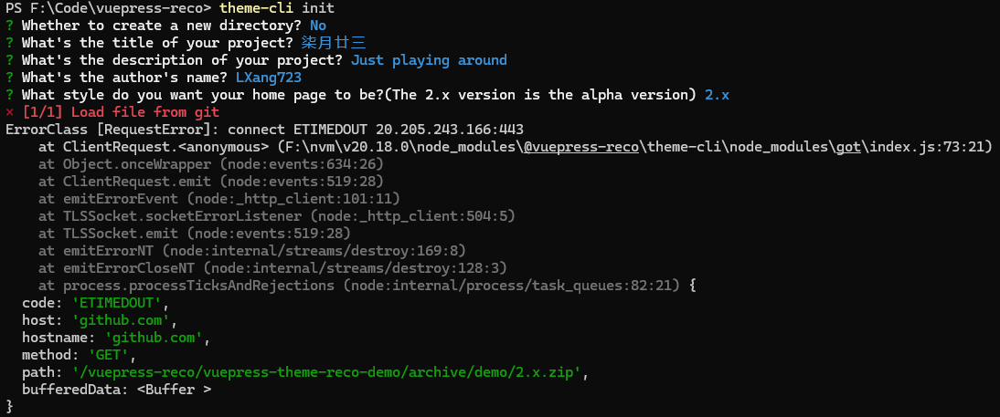

[vuepress-reco](https://theme-reco.vuejs.press/) ：一款简洁的 vuepress 博客 & 文档 主题。

## 快速开始

初始化，并选择 2.x。

### ① 初始化

首先执行 `npm install @vuepress-reco/theme-cli@1.0.7 -g` 命令。


### ② 选择 2.x
在目标文件夹（以 F:\Code\vuepress-reco 为例）执行 `theme-cli init` 命令。

该步骤中有一个 **是否新建文件夹** 选项 `? Whether to create a new directory?` ，根据实际情况选择。如果执行命令的所在路径并不是你想要的存放代码文件路径，比如在 F:\Code 下执行的命令，选择 Y，再填写文件夹名称即可。

在 `? What style do you want your home page to be?` 选项时**选择 2.x** 。

::: info 选择&nbsp;2.x
**PS F:\Code\vuepress-reco>** theme-cli init  
? Whether to create a new directory? No  
? What's the title of your project? 柒月廿三  
? What's the description of your project? Just playing around  
? What's the author's name? LXang723  
? What style do you want your home page to be?(The 2.x version is the alpha version)  
  blog  
  doc  
\> 2.x
:::

其他的 project 、description、author's name 随便填就行，生成时并不会根据你输入的生成。后面在 .vuepress\ [config.ts](https://v2.vuepress.vuejs.org/zh/reference/config.html) 和 [README.md](https://theme-reco.vuejs.press/docs/theme/frontmatter-home.html)  文件中修改配置就行（这里为了演示像那么回事）。

**成功示例：**


**源文件示例：**

``` 
└─ vuepress-reco
   ├─ .vuepress
   |  ├─ public
   |  └─ config.ts
   ├─ blogs
   ├─ docs
   ├─ .gitignore
   ├─ package.json
   ├─ README.md
   └─ yarn.lock
```

**失败示例：**



我这里是因为搭梯子导致的，切换一个节点就好了，和代理的配置有关，但这不是重点。  
注意绿色部分的 `path: '/vuepress-reco/vuepress-theme-reco-demo/archive/demo/2.x.zip'`。  
其实上面的操作就是去 GitHub 的 [vuepress-theme-reco-demo](https://github.com/vuepress-reco/vuepress-theme-reco-demo/tree/demo/2.x) 仓库中
的 `demo/2.x` 分支拉取代码。

[theme-cli](https://github.com/vuepress-reco/theme-cli)

加载成功后，安装依赖，运行即可。

<ImgWithSize src="./image-3.png" alt="vuepress-reco" width="1000" :showBorder="true"/>

::: warning
这是一个警告
:::

::: danger
这是一个危险警告
:::

## 可能遇到的问题


## 自定义一些内容

### SVG 图标

在使用 VuePress 时，`.vuepress/components` 是一个特殊的目录，用来存放自定义 Vue 组件。VuePress 会自动扫描并注册 `.vuepress/components` 目录下的所有组件。  

主题默认将 `/.vuepress/components` 下面的 `.vue` 组件进行了全局注册。

https://github.com/vuepress-reco/vuepress-theme-reco/tree/main/packages/vuepress-theme-reco/src/client/components/icons

``` vue
<IconHome />
``` 

<IconHome />

[vuepress-reco > 图标](https://theme-reco.vuejs.press/docs/guide/icon.html)

[SVG REPO :: Nonicons Programming Icons Collection](https://www.svgrepo.com/collection/nonicons-programming-icons/)

**Vue 组件预览**  

``` markdown
@[preview](@/.vuepress/components/IconHome.vue)
``` 

@[preview](@/.vuepress/components/IconHome.vue)

### 样式

[VuePress 生态系统 > 样式](https://ecosystem.vuejs.press/zh/themes/default/styles.html)

新建 .vuepress/styles/index.**css**

### 字体

.vuepress/styles/index.css

``` css
/* 霞鹜文楷 + Ysabeau Office 字体 */
@font-face {
    font-family: 'LXGWBrightGB';
    src: url('/fonts/LXGWBrightGB-Medium.woff2') format('woff2');
    font-weight: 500;
    font-style: normal;
}
```

[Lxgw Bright](https://github.com/lxgw/LxgwBright) 是由 Ysabeau 系列字体 与 霞鹜文楷系列字体 合并而成的字体，采用 Ysabeau Office 作为西文部分字体，包含 TrueType 格式以及 WOFF2 格式。

**可能用的到**

当你在设计网页时，可能需要将字体文件转换为适用于Web的格式，如.woff或.woff2。这可以确保在不同的浏览器和设备上都能够保持一致的字体显示效果。一些在线转化工具和软件可以帮助您将字体文件转换为Web字体格式，以便在网页上使用。 

字体转换工具推荐:  
- [Cloud Convert: ](https://cloudconvert.com/)
- [Font Convert: ](https://www.fontconverter.io/)
- [Convert Io: ](https://convertio.co/)

## reco，伟大无需多言

demo 的代码已经很久没更新了，虽然 文档 （[vuepress-theme-reco-doc](https://theme-reco.vuejs.press/) ）中的 **最后更新时间** 很新。 

::: details
使用 [DNS Checker](https://dnschecker.org/#A/theme-reco.vuejs.press) 可以看到 A 记录，指向 [GitHub Pages](https://docs.github.com/zh/pages/configuring-a-custom-domain-for-your-github-pages-site/managing-a-custom-domain-for-your-github-pages-site) 的 IP 地址（185.199.108.153）。 
:::

因为 **最后更新时间** 是根据 文档的站点仓库 [vuepress-reco.github.io](https://github.com/vuepress-reco/vuepress-reco.github.io) 更新时间来的。
但是 [vuepress-theme-reco](https://github.com/vuepress-reco/vuepress-theme-reco) 仓库，作者几个月前还在更新。  

**reco，伟大无需多言**！

[为作者贡献一杯奶茶](https://theme-reco.vuejs.press/docs/others/donate.html) :rose: :rose: :rose:。

<ImgWithSize src="./image-6.png" alt="为作者贡献一杯奶茶" />