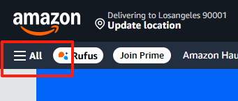
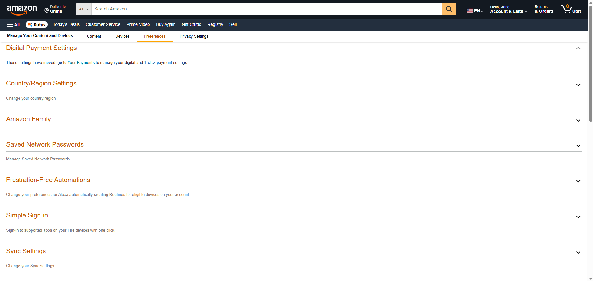

[Add an Email Address to Receive Documents in Your Kindle Library](https://www.amazon.com/gp/help/customer/display.html?nodeId=GX9XLEVV8G4DB28H)

[Learn About Sending Documents to Your Kindle Library](https://www.amazon.com/gp/help/customer/display.html?nodeId=G5WYD9SAF7PGXRNA)

## 查看 Kindle 邮箱地址

### 1. 登录

登录[亚马逊账户](https://www.amazon.com/)（注意用与你 Kindle 绑定的账号）。

### 2. 管理内容与设备

进入 **Manage Your Content and Devices（管理内容与设备）**。

登录后直接访问 [Manage Your Content and Devices](https://www.amazon.com/mycd) ，或以其他方式进入：

**方式 2**：点击右上角 **Accounts & Lists** → **Content & Devices**
（有时显示为 "Devices" 或 "Manage Your Content and Devices"）


**方式 3**：点击左上角 **ALL**，显示所有菜单。



在 **Digital Content & Devices** 分类下，找到 **Kindle E-readers & Books** 。


在 **Apps & Resources** 分类下，找到 **Manage Your Content and Devices** 。


### 3. 偏好设置

切换到 **Preferences（偏好设置）** 选项卡。



### 4. 个人文档设置

往下找到 **Personal Document Settings（个人文档设置）**，可以点击蓝色的 **Learn more** 文字，了解更多内容。


在 **Send-to-Kindle E-mail Settings** 里，你会看到类似：

```
yourname_xxx@kindle.com
```

这就是你的 **Kindle 接收邮箱**（一个账号可有多个设备邮箱，比如：Xang's 2nd Android Device 是我的安卓平板 Kindle 邮箱，Xang's Android Device 是我的安卓手机 Kindle 邮箱，数据都是同步的，可以重命名）。

## 添加批准的推送邮箱

1. 在同一个 **Personal Document Settings** 里找到
   **Approved Personal Document E-mail List（已批准邮箱名单）**。
2. 点击 **Add a new e-mail address**。
3. 添加你的发送邮箱（如 `xxx@gmail.com`），保存。

> 只有在这个名单里的邮箱才能推送文件，否则 Kindle 会拒收或触发验证。

## 推送到 Kindle

### 通过邮件直接推送

1. 用你**已添加的邮箱**发邮件到你的 Kindle 邮箱（`xxx@kindle.com`）。
2. **邮件标题可选**：
   - 如果要转换 PDF 为 Kindle 格式，标题输入 `convert`（全小写）。
   - 其他情况可随意填写或留空。
3. **附件要求**：
   - 支持的格式：`MOBI, PDF, DOC, DOCX, RTF, TXT, HTML, JPEG, PNG, GIF, BMP` 等。
   - 单个附件 ≤ 50MB（大文件建议先压缩或用云盘转）。
4. 发送邮件，等待几分钟，Kindle 会自动接收（需要设备联网）。

### 用 Kindle 官方工具推送

[www.amazon.com/sendtokindle](https://www.amazon.com/sendtokindle)

