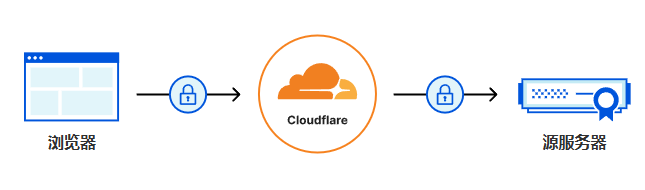
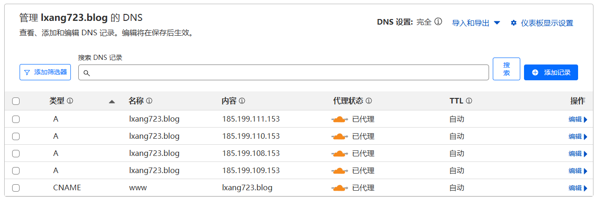

[Cloudflare](https://dash.cloudflare.com/) ：是一个提供内容分发网络（CDN）、网络安全、域名解析（DNS）以及其他互联网基础设施服务的公司。它主要通过提升网站的加载速度、提供 DDoS 防护、增强安全性等功能来帮助网站更高效、更安全地运行。

## 参考链接

- [Cloudflare使用教程（注册、添加站点、开启CDN、缓存优化设置等）](https://www.fujieace.com/web/safety/cloudflare-using-tutorials.html)
- [Cloudflare Docs](https://developers.cloudflare.com/learning-paths/get-started-free/?utm_medium=email&utm_source=transactional&utm_campaign=ca-confirmed-free)

## Cloudflare 的好处

免费计划（最重要的）：Cloudflare 提供免费计划，适用于小型网站或个人项目。在免费计划下，你仍然可以享受到 CDN 加速和一些基本的安全功能。

内容分发网络（CDN）：Cloudflare 拥有全球多个数据中心，能够缓存静态内容（如图像、JavaScript 和 CSS 文件）并将其分发到离用户最近的服务器，这大大减少了加载时间，提高了网站响应速度。

其他的我不关心。

## 使用 Cloudflare 代理

添加并激活域名，之后会分配一组名称服务器。

[Add and activate your domain](https://developers.cloudflare.com/learning-paths/get-started-free/onboarding/add-and-activate/)

添加 DNS 记录（和 NameSilo 的 DNS 记录一样）：

## 更改域名服务器

参考 [NameSilo 的使用](namesilo.md) 的 **# 更改域名服务器** 部分。

## Cloudflare 设置

左侧栏选择 **SSL/TLS -> 概述**：

  - 配置加密模式：SSL/TLS 加密部分，点击 **配置** 按钮。SSL 模式设置为：完全（严格） `Full (strict)`。  

左侧栏选择 **SSL/TLS -> 边缘证书**：
- 始终使用 HTTPS（Always Use HTTPS）：开启。
- 自动 HTTPS 重写（Automatic HTTPS Rewrites）：开启。

[什么是 SSL？ | SSL 定义](https://www.cloudflare.com/zh-cn/learning/ssl/what-is-ssl/)  

SSL/TLS证书允许网站在URL开头使用https（而不是http），这是一种更安全的连接协议。HTTPS对网站安全、用户隐私、SEO等等都有好处。

## 遇到的问题

### Invalid SSL certificate Error code 526

[Check domain SSL/TLS](https://developers.cloudflare.com/learning-paths/get-started-free/onboarding/check-ssl/)

[Error 526: invalid SSL certificate](https://developers.cloudflare.com/support/troubleshooting/cloudflare-errors/troubleshooting-cloudflare-5xx-errors/#error-526-invalid-ssl-certificate)

::: info Error&nbsp;526
Error 526 occurs when these two conditions are true:
1. Cloudflare cannot validate the SSL certificate at your origin web server, and
2. Full SSL (Strict) SSL is set in the Overview tab of your Cloudflare SSL/TLS app.
:::

可以理解为：
1. 源服务器的 SSL 证书有问题。
2. 并且 SSL 模式设置的 `Full (strict)`。

::: info Note
For a potential quick fix, set **SSL** to Full instead of Full (strict) in the **Overview** tab of your Cloudflare **SSL/TLS** app for the domain.
:::

快速修复：将 SSL 模式从 `Full (strict)` 更改为 `Full`。  
的确改为 Full 后，问题解决。  
但是我们想要使用 Full (strict) ，我这里的原因是未勾选 Enforce HTTPS，因为无法勾选。

### Enforce HTTPS 无法勾选

[自定义域和 GitHub Pages 疑难解答 > HTTPS 错误](https://docs.github.com/zh/pages/configuring-a-custom-domain-for-your-github-pages-site/troubleshooting-custom-domains-and-github-pages#https-errors)

::: info HTTPS&nbsp;错误
配置自定义域后，您的站点可能需要最多一个小时才能通过 HTTPS 访问。 更新现有 DNS 设置后，您可能需要删除自定义域并将其重新添加到站点仓库，以触发启用 HTTPS 的进程。
:::

可以尝试配置 DNS 记录使用子域 （例如 www.lxang723.blog）指向 `<username>.github.io` ，触发启用 HTTPS 的进程。
