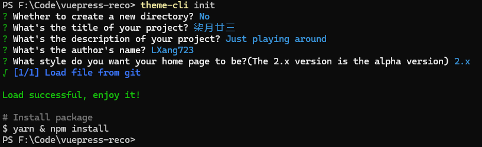

[vuepress-reco](https://theme-reco.vuejs.press/) ：一款简洁的 vuepress 博客 & 文档 主题。

## 快速开始

初始化，并选择 2.x。

### ① 初始化

首先执行 `npm install @vuepress-reco/theme-cli@1.0.7 -g` 命令。


### ② 选择 2.x
在目标文件夹（以 F:\Code\vuepress-reco 为例）执行 `theme-cli init` 命令。

该步骤中有一个 **是否新建文件夹** 选项 `? Whether to create a new directory?` ，根据实际情况选择。如果执行命令的所在路径并不是你想要的存放代码文件路径，比如在 F:\Code 下执行的命令，选择 Y，再填写文件夹名称即可。

在 `? What style do you want your home page to be?` 选项时**选择 2.x** 。

::: info 选择&nbsp;2.x
**PS F:\Code\vuepress-reco>** theme-cli init  
? Whether to create a new directory? No  
? What's the title of your project? 柒月廿三  
? What's the description of your project? Just playing around  
? What's the author's name? LXang723  
? What style do you want your home page to be?(The 2.x version is the alpha version)  
  blog  
  doc  
\> 2.x
:::

其他的 project 、description、author's name 随便填就行，生成时并不会根据你输入的生成。后面在 .vuepress\ [config.ts](https://v2.vuepress.vuejs.org/zh/reference/config.html) 和 [README.md](https://theme-reco.vuejs.press/docs/theme/frontmatter-home.html)  文件中修改配置就行（这里为了演示像那么回事）。

#### 成功示例



#### 源文件示例

``` 
└─ vuepress-reco
   ├─ .vuepress
   |  ├─ public
   |  └─ config.ts
   ├─ blogs
   ├─ docs
   ├─ .gitignore
   ├─ package.json
   ├─ README.md
   └─ yarn.lock
```
加载成功后，安装依赖，运行即可。

#### 失败示例


我这里是因为搭梯子导致的，切换一个节点就好了，和代理的配置有关，但这不是重点。  
注意绿色部分的 `path: '/vuepress-reco/vuepress-theme-reco-demo/archive/demo/2.x.zip'`。  
其实上面的操作就是去 GitHub 的 [vuepress-theme-reco-demo](https://github.com/vuepress-reco/vuepress-theme-reco-demo/tree/demo/2.x) 仓库中
的 `demo/2.x` 分支拉取代码。  

写这篇文时，发现这个主题的版本已经更新到了 2.0.0-rc.25 。 [查看 vuepress-theme-reco 版本号](https://www.npmjs.com/package/vuepress-theme-reco?activeTab=versions)

可在 `package.json` 文件中更换 vuepress-theme-reco 的版本，一般初始化时（首次安装）就是最新版的，作者会更新 `demo/2.x` 仓库 package.json 中 vuepress-theme-reco 的版本。

## 遇到的问题

### 系列 series 相关问题  

- 自动设置系列无效（未解决）。

[issues 278](https://github.com/vuepress-reco/vuepress-theme-reco/issues/278)

- 系列不支持多级目录（未解决）。

[issues 189](https://github.com/vuepress-reco/vuepress-theme-reco/issues/189)

- 如果未指定 tags，只设置了 categories，如果有相同分类下的文章设置了 series，那么这个未指定 tags 的文档也会出现在系列中。

### 社交链接 socialLinks

- socialLinks 和 docsRepo 同时配置，切换导航时会重复生成 IconGithub 。


将 `vuepress-theme-reco` 版本升级到 `2.0.0-rc.25` 解决。


## 自定义一些内容

### 图标

主题默认将 `/.vuepress/components` 下面的 `.vue` 组件进行了全局注册。

操作参考主题文档： [vuepress-reco > 图标](https://theme-reco.vuejs.press/docs/guide/icon.html) 。

[主题中已包含的图标](https://github.com/vuepress-reco/vuepress-theme-reco/tree/main/packages/vuepress-theme-reco/src/client/components/icons) 。

**Vue 组件预览**   

@[preview](@/.vuepress/components/IconHome.vue)

推荐图标库： [SVG REPO :: Nonicons Programming Icons Collection](https://www.svgrepo.com/collection/nonicons-programming-icons/)

温馨提示：  
记得设置 svg 中的 [fill](https://developer.mozilla.org/zh-CN/docs/Web/SVG/Attribute/fill) 属性和 [stroke](https://developer.mozilla.org/zh-CN/docs/Web/SVG/Attribute/stroke) 属性：`fill="currentColor"`、`stroke="currentColor"`，深色/浅色模式切换时会受影响 。

### 样式

[VuePress 生态系统 > 样式](https://ecosystem.vuejs.press/zh/themes/default/styles.html)

[vuepress-reco > 自定义样式](https://theme-reco.vuejs.press/docs/guide/custom-style.html)

**创建 .vuepress/styles/index.css** ：在 .vuepress 文件夹中创建 styles 文件夹，并在其中创建 index.css 文件。

通过编辑这个文件，你可以增加自定义样式或覆盖该主题的默认样式。  

优先级：index.css 文件中的样式会覆盖 VuePress 默认样式，但如果有其他样式文件（例如主题的样式）也修改了相同的元素样式，后加载的样式会生效。  

使用 !important 来强制应用样式（但尽量避免过度使用 !important）。

### 字体

我刚开始在项目中添加了 Lxgw Bright 字体文件，首次渲染时字体加载很慢。尽管 .woff2 文件相较于 .woff 和 .ttf 已经过压缩，但它仍然可能比较大，尤其是如果包含了很多字体样式和字符集。

推荐使用 **适用于浏览器加载的汉字字体集**，可通过 CDN 直接引用或者下载包到自己的项目中。  
地址：[Jsdelivr：wc-ex/cn-fontsource](https://www.jsdelivr.com/?query=author%3A%20wc-ex) | 
[GitHub：wc-ex/cn-fontsource](https://github.com/wc-ex/cn-fontsource)，  


[JSDelivr](https://www.jsdelivr.com/) 是一个免费的、快速且可靠的开源 CDN（内容分发网络），用于托管和分发 JavaScript 库、CSS 框架以及其他 Web 资源。它在开发者中非常受欢迎，因为它支持快速加载常见的前端库，如 jQuery、React、Vue.js、Bootstrap、Font Awesome 等。

[Lxgw Bright](https://github.com/lxgw/LxgwBright) 是由 Ysabeau 系列字体 与 霞鹜文楷系列字体 合并而成的字体，采用 Ysabeau Office 作为西文部分字体，包含 TrueType 格式以及 WOFF2 格式。

Ysabeau Office： [@fontsource/ysabeau-office](https://www.jsdelivr.com/package/npm/@fontsource/ysabeau-office) 。    
霞鹜文楷屏幕阅读版： [cn-fontsource-lxgw-wen-kai-gb-screen](https://www.jsdelivr.com/package/npm/cn-fontsource-lxgw-wen-kai-gb-screen)  。

#### 1. 通过 npm 本地安装

以 **霞鹜文楷屏幕阅读版**  为例： 

``` bash
npm i cn-fontsource-lxgw-wen-kai-gb-screen  
```

在 .vuepress/styles/index.css 中导入： 

``` css
@import "cn-fontsource-lxgw-wen-kai-gb-screen/font.css";  
```

#### 2. 或使用 Jsdelivr CDN 加载

config.ts 中配置 head 。

``` ts
head: [
  // ['link', { rel: 'icon', href: '/favicon.ico' }]
  ['link', { rel: 'stylesheet', href: 'https://cdn.jsdelivr.net/npm/@fontsource/ysabeau-office@5.1.1/index.min.css' }],
  ['link', { rel: 'stylesheet', href: 'https://cdn.jsdelivr.net/npm/cn-fontsource-lxgw-wen-kai-gb-screen/font.css' }]
]
```
#### 3. 在 .vuepress/styles/index.css 中添加 body 字体样式

``` css
body {
  font-family: "Ysabeau Office", "LXGW WenKai GB Screen" !important;
  font-weight: normal !important;
  font-size: 18px !important;
}
```

## reco，伟大无需多言

开源真的太伟大了。

[为作者贡献一杯奶茶](https://theme-reco.vuejs.press/docs/others/donate.html) :rose: :rose: :rose:。


## 仓库链接

[vuepress-theme-reco](https://github.com/vuepress-reco/vuepress-theme-reco) 

[vuepress-theme-reco-doc](https://theme-reco.vuejs.press/)

文档的站点仓库： [vuepress-reco.github.io](https://github.com/vuepress-reco/vuepress-reco.github.io)   
