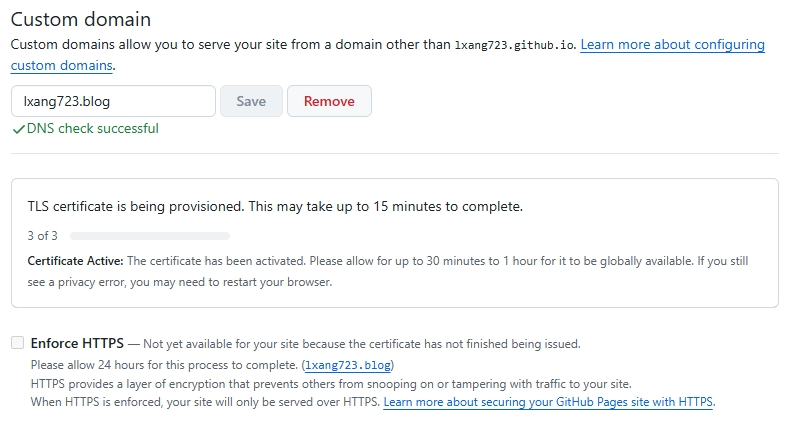

我的博客地址：[lxang723.blog](https://lxang723.blog)  

本博客使用 VuePress 2 和 vuepress-reco 2.x 主题搭建，并通过 GitHub Pages 和 GitHub Actions 实现自动化部署。

## 1. VuePress 和 Reco

[VuePress](https://v2.vuepress.vuejs.org/zh/guide/introduction.html)  是一个以 Markdown 为中心的静态网站生成器。  
VuePress 可以将 Markdown 文件编译为 HTML，并且根据 Markdown 文件的相对路径自动生成路由。  
[VuePress 市场](https://marketplace.vuejs.press/zh/) 中提供很多插件与主题，[Reco](https://theme-reco.vuejs.press/) 则是一款简洁的 vuepress 博客 & 文档 主题。  
Reco 主题的使用可参考：[Vuepress-Reco 的使用](vuepress-reco.md) 。  

同时推荐：  
- [VitePress](https://vitepress.dev/zh/)：由 Vite 和 Vue 驱动的静态站点生成器。
- [@sugarat/theme](https://theme.sugarat.top/) ：简约风的 Vitepress 博客主题。  
- [Curve](https://github.com/imsyy/vitepress-theme-curve)：A Simple VitePress Theme，以及作者博客预览 [無名小栈](https://blog.imsyy.top/) 。

## 2. 使用 GitHub Pages 创建个人站点

GitHub Pages 是通过 GitHub 托管和发布的公共网页。
GitHub Pages 是一项静态站点托管服务，它直接从 GitHub 上的仓库获取 HTML、CSS 和 JavaScript 文件，（可选）通过构建过程运行文件，然后发布网站。

[GitHub Pages 文档](https://docs.github.com/zh/pages)  

::: details GitHub&nbsp;Pages&nbsp;站点的类型

GitHub Pages 站点共有三种类型：个人、组织和项目。

**个人站点（用户页面仓库）：** 仓库名称为 `<username>.github.io` ，对应的访问地址为 `http(s)://<username>.github.io`。例如：仓库名称为 `lxang723.github.io` ，则访问地址为 `https://lxang723.github.io`。  

**项目站点（项目页面仓库）：** 仓库名称为 `<repository>` ，对应的访问地址为 ``http(s)://<username>.github.io/<repository>``。
例如：仓库名称为 `blog` ，则访问地址为 `https://lxang723.github.io/blog`，会包含二级目录。

如果你有购买域名的打算，建议创建个人站点。

发布时，站点类型对 .vuepress\config.ts 中的 base 也会有影响，可参考 [VuePress 部署](https://v2.vuepress.vuejs.org/zh/guide/deployment.html) 。

:::

### 2.1 为站点创建仓库

- 在任何页面的右上角，点击 **+** 按钮，点击 `New repository`，新建仓库。  
- 在 **Repository name** 输入 `<username>.github.io`。  
- 选择仓库可见性 `Public`。  
- 勾选 `Add a README file`。（GitHub Pages 将查找 index.html、index.md 或 README.md 文件，作为站点的入口文件）  
- 点击 `Create repository`，创建仓库。

### 2.2 创建站点（配置站点的发布源）

必须先在 GitHub 上有站点的仓库，然后才可创建站点。

- 在 `<username>.github.io` 仓库主页面中，点击 `Settings`，进入设置页面。  
- 点击侧边栏 **Code and automation**（代码和自动化）下的 `Pages`，进入 **GitHub Pages** 配置页面。  
- **Build and deployment**（构建和部署）的 **Source**（源）下，选择 `Deploy from a branch` （从分支进行部署）。  
- **Build and deployment** 的 **Branch**（分支） 选择 `main`，**folder** 选择 `/(root)`，点击 Save 。  
  注：后续使用 GitHub Actions 时，需将发布源切换为 `gh-pages` 分支。  
- 点击 `Visit site`（访问网站）按钮，查看已发布的网站。

上述操作只是 GitHub Pages 快速入门 。

---

经过 2.1 和 2.2 的操作，我们已经可以看到 GitHub Pages 站点的效果了。

**思考：**  

假设你已经成功运行了 vuepress-reco 2.x ，现在想要把 vuepress-reco 部署到站点，我们先要执行 `npm run build` 在 `.vuepress/dist` 文件夹下生成静态文件，
然后将静态文件上传到站点仓库中。

同时，我们也想使用这个仓库管理文章和代码，也就是文章和静态文件在同一个仓库。
我们可以使用 `main` 分支管理文章和代码，再创建一个 `gh-pages` 分支来存放生成的静态文件，将 `gh-pages` 分支作为发布源。
这样一来我们每次发布文章时，需要上传到 `main` 分支，再将静态文件上传到 `gh-pages` 分支。

现在，我们需要简化部署流程，使用 GitHub Actions 工作流来构建和部署站点源文件，实现自动化部署。  
在对 `main` 分支进行推送后，自动触发部署任务：
对 `main` 分支的代码进行 `npm install && npm run build`，然后将 `.vuepress/dist` 文件夹下生成静态文件推送到 `gh-pages` 分支，发布站点。

这样一来，每次发布文章时，只需要推送到 `main` 分支即可，无需手动构建和部署。

## 3. 使用 GitHub Actions 自动部署博客

GitHub Actions 是一种持续集成和持续交付 (CI/CD) 平台，可用于自动执行生成、测试和部署管道。 你可以创建工作流，以便在推送更改到存储库时运行测试，或将合并的拉取请求部署到生产环境。

[GitHub Actions 文档](https://docs.github.com/zh/actions)

### 3.1 创建个人访问令牌

创建 Personal access tokens (PAT)。

- **登录 GitHub，进入个人设置**： 在右上角点击你的头像，然后选择 **Settings** 进入设置页面。  
- **进入开发者设置**： 在左侧边栏中，滚动到最底部，点击 **Developer Settings**。  
- **创建新 Token**： 在开发者设置页面，点击侧边栏 **Personal access tokens**，然后选择 **Tokens (classic)**。
  点击右上角的 `Generate new token` 按钮，选择 **Generate new toke (classic)** 。  
- **填写 Token 详细信息**：  
  **Note**： 为这个 token 添加备注，方便你之后识别。  
  **Expiration**： 选择 token 的有效期（可选）。如果你不希望 token 过期，可以选择 No expiration 。  
  **Select scopes**： 勾选 `repo` 和 `workflow` 权限。
- **生成 Token**： 配置完成后，点击 `Generate token` 按钮生成 token。
- **复制 Token**： 生成后，立即复制并保存 token，因为你以后无法查看该 token。如果忘记复制，你只能重新生成一个新的 token。
  点击条目进入 **Edit personal access token (classic)** ，点击 `Regenerate token` 按钮重新生成。

### 3.2 设置仓库秘钥

设置 Repository secrets：在 GitHub Actions 中使用 Personal Access Token 。 

- 在仓库主页面中，点击 Settings > **Secrets and variables** > Actions，然后点击 `New repository secret` 按钮，添加仓库秘钥。 
- 设置 **Name** 名称为 `ACCESS_TOKEN` （该名称在工作流文件中会用到），然后将生成的 token 粘贴到 **Secret**（修改时值为 Value） 栏中 。

### 3.3 配置工作流权限

GitHub Actions 在将静态文件推送到 gh-pages 分支时需要写入权限。

- 在仓库主页面中，进入 Settings > **Actions** > General 。
- 将 **Workflow permissions** 设置为 `Read and write permissions`。

也可以在工作流文件中添加权限。

### 3.4 编写工作流文件

在 vuepress-reco 项目根目录下，创建 `.github/workflows/deploy.yml` 的文件，定义自动部署流程。

::: info Note
若要使 GitHub 在存储库中发现任何 GitHub Actions 工作流，必须将工作流文件保存在名为 .github/workflows 的目录中。

你可以为工作流文件指定所需的任何名称，但必须使用 .yml 或 .yaml 作为文件扩展名。
:::

``` yaml

name: Deploy VuePress Site

# 触发条件：在 push 到 main  分支后
on:
  push:
    branches:
      - main

# 任务
jobs:
  build-and-deploy:
    # 服务器环境：最新版 Ubuntu
    runs-on: ubuntu-latest
    steps:

      # 拉取代码
      - name: Checkout code
        uses: actions/checkout@v4
        with:
          fetch-depth: 0
      
      # 设置 Node.js
      - name: Set up Node.js
        uses: actions/setup-node@v4
        with:
          node-version: 20
          # 启用缓存，加速构建，提高效率
          cache: npm
      
      # 可以使用 npm install && npm run build 将两步合并
      - name: Install dependencies
        run: npm install
      
      - name: Build VuePress site
        run: npm run build

      # 部署到 GitHub Pages
      - name: Deploy to GitHub Pages
        uses: JamesIves/github-pages-deploy-action@v4
        with:
          ACCESS_TOKEN: ${{ secrets.ACCESS_TOKEN }}
          BRANCH: gh-pages
          FOLDER: .vuepress/dist

```

**注意**：`cache: npm`：可以缓存依赖项来加快工作流运行。
默认情况下，会根据锁定文件（ package-lock.json 或 yarn.lock ）等文件生成唯一的缓存键。
所以项目中的 package-lock.json 需提交到 Git 仓库中。  

**参考**：  
[GitHub Actions 的工作流语法](https://docs.github.com/zh/actions/writing-workflows/workflow-syntax-for-github-actions)  
[构建和测试 Node.js](https://docs.github.com/zh/actions/use-cases-and-examples/building-and-testing/building-and-testing-nodejs#installing-dependencies)  
[缓存依赖项以加快工作流程](https://docs.github.com/zh/actions/writing-workflows/choosing-what-your-workflow-does/caching-dependencies-to-speed-up-workflows)  

---

完成以上步骤后，每次将文章推送到 `main` 分支，GitHub Actions 会自动触发工作流，构建并部署静态文件到 GitHub Pages。

可以在仓库主页面的 `Actions` 查看工作流程结果。

## 4. 使用自定义域名

GitHub Pages 支持使用自定义域名，或者将网站的 URL 根目录从默认值（如 lxang723.github.io）更改为你拥有的任何域名。

[管理 GitHub Pages 站点的自定义域](https://docs.github.com/zh/pages/configuring-a-custom-domain-for-your-github-pages-site/managing-a-custom-domain-for-your-github-pages-site)

### DNS 配置参考

- [NameSilo 的使用](namesilo.md)
- [Cloudflare 的使用](cloudflare.md)

如果从自定义 GitHub Actions 工作流进行发布，则忽略且无需任何 CNAME 文件。

### 设置自定义域名

- 在仓库主页面中，点击 **Settings > Pages**，进入 **GitHub Pages** 配置页面。 
- 在 **Custom domain** 输入框中，输入你自己的域名，点击 `Save` 保存设置 。

保存之后 GitHub Pages 会自动检测。

等待变绿， **DNS Check in Progress**（黄色） -> **DNS check successful**（绿色）。



### 使用 HTTPS 保护 GitHub Pages 站点

等待发放 TLS 证书， 此时的 **Enforce HTTPS** 为禁用状态。

发放 TLS 证书后，勾选 **Enforce HTTPS** 。

[使用 HTTPS 保护 GitHub Pages 站点](https://docs.github.com/zh/pages/getting-started-with-github-pages/securing-your-github-pages-site-with-https)
