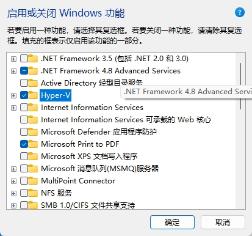

## Windows11 安装 Docker

## 1. Hyper-V 和 WSL

[Hyper-V 和 WSL](hyper-v-and-wsl.md)  

## 2. 启用 Hyper-V

### 2.1. 设置中搜索 **启用或关闭 Windows 功能**

### 2.2. 勾选 Hyper-V

注：Windows家庭版请升级至专业版。

**推荐链接**  
博客园   
[DockerDesktop安装指南以及Windows下WSL2和 Hyper-V相关问题追查](https://www.cnblogs.com/qfl-blog/p/18200575)  
Microsoft 文档  
[Windows 上的 Hyper-V 简介](https://learn.microsoft.com/zh-cn/virtualization/hyper-v-on-windows/about/)  
[在 Windows 上启用 Hyper-V](https://learn.microsoft.com/zh-cn/virtualization/hyper-v-on-windows/quick-start/enable-hyper-v#check-requirements)  
[Windows 11 Hyper-V 系统要求](https://learn.microsoft.com/zh-cn/virtualization/hyper-v-on-windows/reference/hyper-v-requirements)  
Docker 官方文档  
[Install Docker Desktop on Windows](https://docs.docker.com/desktop/setup/install/windows-install/)  
[Get Docker Desktop](https://docs.docker.com/get-started/introduction/get-docker-desktop/)  
