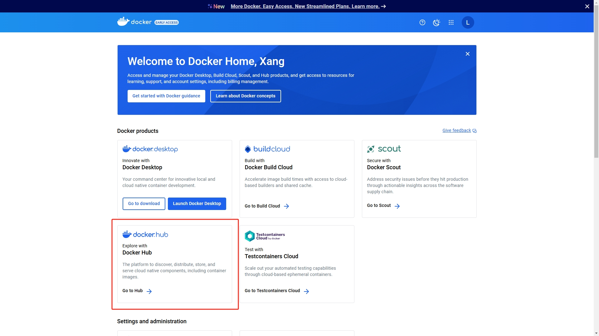
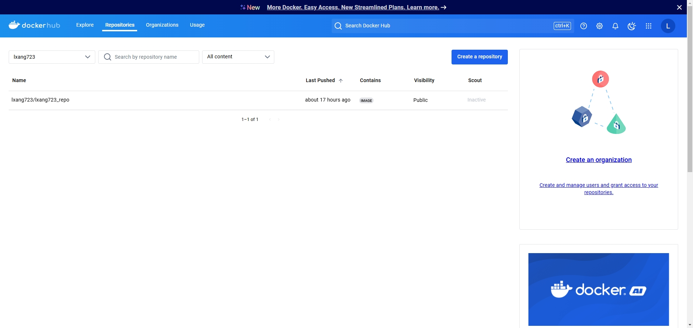
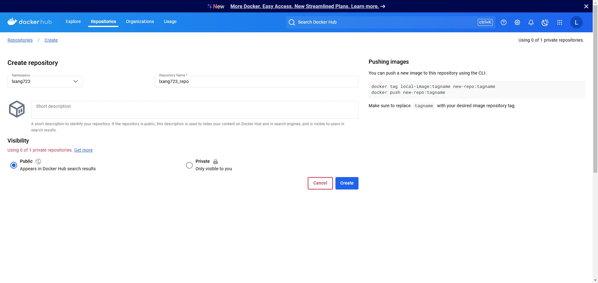
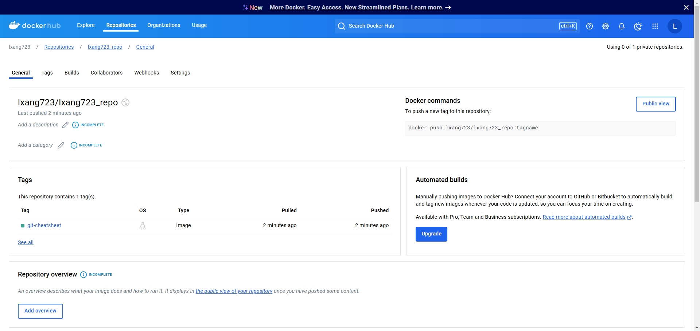
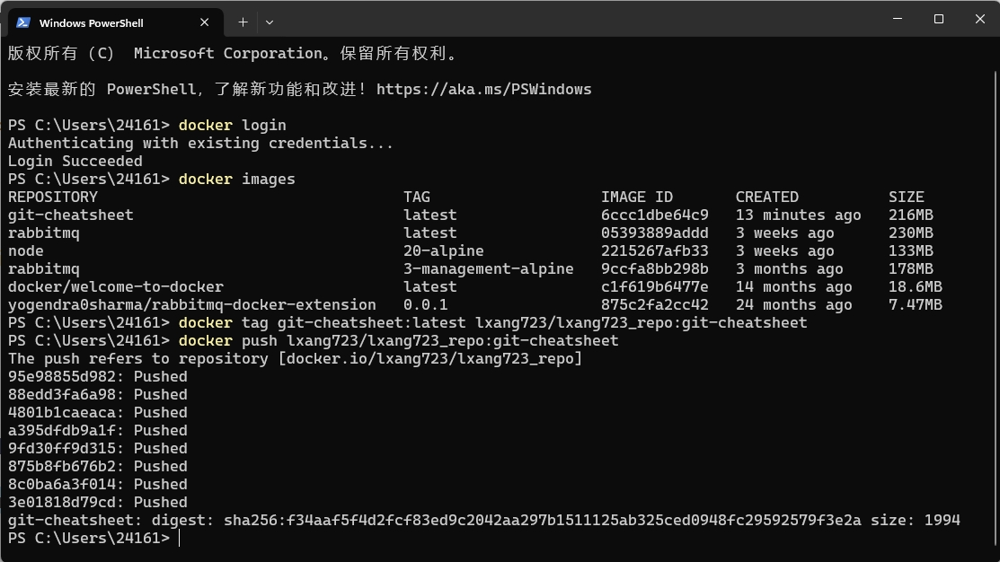
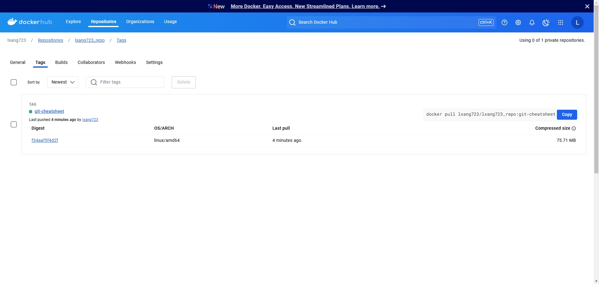

[Docker Hub quickstart](https://docs.docker.com/docker-hub/quickstart/)

[docker CLI reference](https://docs.docker.com/reference/cli/docker/)

将 Docker 镜像推送到 Docker Hub。

## 0. 准备工作

### 创建仓库

[Create a repository](https://docs.docker.com/docker-hub/repos/create/)

[Push images to a repository](https://docs.docker.com/docker-hub/repos/manage/hub-images/push/)


[Dockerfile reference](https://docs.docker.com/reference/dockerfile/)
[Dockerfile overview](https://docs.docker.com/build/concepts/dockerfile/)

创建一个镜像仓库（如果还没有的话）。

进入 [Docker Home](https://app.docker.com/)。 



点击 `docker.hub` 卡片上的 `Go to Hub` 进入 `Repositories`。



点击 `Create a repository` 按钮进行创建仓库。



页面右侧有推荐命令。
::: info Pushing&nbsp;images
You can push a new image to this repository using the CLI:  
``` bash
docker tag local-image:tagname new-repo:tagname
docker push new-repo:tagname
```
Make sure to replace `tagname` with your desired image repository tag.
:::



::: info Docker&nbsp;commands
To push a new tag to this repository:
``` bash
docker push lxang723/lxang723_repo:tagname
```
:::

接下来进入正题。

## 1. 登录 Docker 仓库

``` bash
docker login
```



## 2. 标记镜像

``` bash
docker tag git-cheatsheet:latest lxang723/lxang723_repo:git-cheatsheet
```

<仓库地址>/<用户名>/<镜像名称>:<标签>

## 3. 推送镜像

``` bash
docker push lxang723/lxang723_repo:git-cheatsheet
```

## 4. 拉取镜像

在 `Tags` 标签页，镜像右侧有对应的拉取命令。



``` bash
docker pull lxang723/lxang723_repo:git-cheatsheet
```
