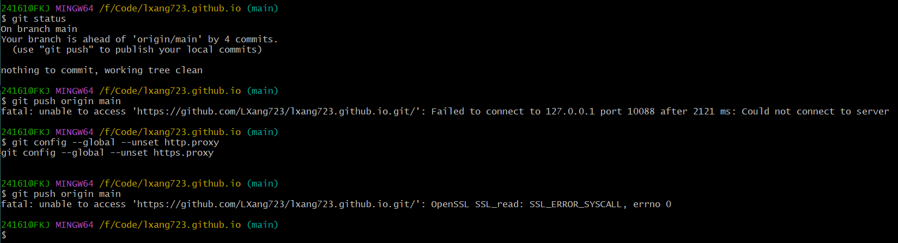

[Git 官方网站](https://git-scm.com/)  
- [Reference](https://git-scm.com/docs)  
快速参考指南：Quick reference guides: [GitHub Cheat Sheet](https://training.github.com/downloads/zh_CN/github-git-cheat-sheet/)  | [Visual Git Cheat Sheet](https://ndpsoftware.com/git-cheatsheet.html#loc=stash;)  
所有命令的完整列表：
[Complete list of all commands](https://git-scm.com/docs/git#_git_commands)
- [Book](https://git-scm.com/book/zh/v2)  
中文版下载：[Releases · progit/progit2-zh: Pro Git 2nd Edition](https://github.com/progit/progit2-zh/releases)   

[GitHub 文档](https://docs.github.com/zh/get-started/getting-started-with-git/set-up-git)  
[GeeksforGeeks Git Cheat Sheet](https://www.geeksforgeeks.org/git-cheat-sheet/)  

## 设置 Git

安装完 Git 之后，要做的第一件事就是设置你的用户名和邮件地址。 这一点很重要，因为每一个 Git 提交都会使用这些信息，它们会写入到你的每一次提交中，不可更改：

对所有本地仓库的用户信息进行配置。  
打开Git Bash：
### 设置用户名和邮件地址 Set your username globally.
``` bash
git config --global user.name "yourname"
git config --global user.email "youremail@example.com"
```
为一个仓库设置 Git 用户名

确认设置
``` bash
git config --global
```
### 启用彩色命令行输出
``` bash
git config --global color.ui auto
```

### 启用彩色命令行输出
``` bash
git help
```
### 存储配置
``` bash
git config --global credential.helper store
```

检查配置信息。

```
git config --list
```

## 仓库

### 创建一个新的本地仓库
``` bash
git init <project-name>
```
省略 project-name 则在当前目录创建。

### 克隆一个远程仓库
``` bash
git clone <url>
```

### 修改 Git 远程仓库地址：

``` bash
git remote set-url origin <新的仓库地址>
```

例如：

``` bash
git remote set-url origin https://github.com/username/repository.git
```

这样就更新了远程仓库地址。如果你想查看修改后的地址，可以运行：

``` bash
git remote -v
```

## 遇到的问题



先尝试 VPN -> 修复无法联网（VPN 停掉了，相关配置重置一下）

fatal: unable to access 'xxx': Failed to connect to 127.0.0.1 port 10088 after 2121 ms: Could not connect to server

``` bash
git config --global --unset http.proxy 
git config --global --unset https.proxy
```

fatal: unable to access 'xxx': OpenSSL SSL_read: SSL_ERROR_SYSCALL, errno 0

``` bash
git config --global http.sslVerify "false"
```

fatal: unable to access 'xxx': Failed to connect to github.com port 443 after 21045 ms: Could not connect to server


设置代理
``` bash
git config --global http.proxy 127.0.0.1:10088
git config --global https.proxy 127.0.0.1:10088
```
设置 -> 网络和Internet -> 代理


## 将指定的文件添加到暂存区

### 添加单个文件：  
git add <文件路径> ，例如：
``` bash
git add index.html
```
### 添加多个文件

git add <文件路径1> <文件路径2> ... ，例如：

``` bash
git add index.html style.css app.js
```

### 添加当前目录下的所有文件：
``` bash
git add .
```
### 添加特定类型的文件：

添加特定类型的文件，可以使用通配符。例如，添加所有 .js 文件：
``` bash
git add *.js
```

# Git 命令备忘单

## 1. 基础命令

| **命令**                         | **说明**                                    |
|----------------------------------|---------------------------------------------|
| `git init`                       | 初始化一个新的 Git 仓库                        |
| `git clone <repository>`         | 克隆远程仓库到本地                           |
| `git status`                     | 查看当前工作区和暂存区的状态                    |
| `git add <file>`                 | 将文件添加到暂存区                             |
| `git commit -m "message"`        | 提交暂存区的更改并附带提交信息                  |
| `git diff`                       | 查看工作区和暂存区的差异                        |
| `git log`                        | 查看提交历史                                  |
| `git log --oneline`              | 以简洁的一行形式查看提交历史                    |
| `git reset <file>`               | 从暂存区移除文件                              |
| `git reset --hard`               | 重置工作区和暂存区，回退到上一个提交               |

## 2. 分支管理

| **命令**                         | **说明**                                    |
|----------------------------------|---------------------------------------------|
| `git branch`                     | 列出本地所有分支并标记当前分支                   |
| `git branch <branch-name>`       | 创建一个新分支                               |
| `git checkout <branch-name>`     | 切换到指定的分支                             |
| `git checkout -b <branch-name>`  | 创建并切换到一个新分支                        |
| `git merge <branch-name>`        | 合并指定分支到当前分支                         |
| `git branch -d <branch-name>`    | 删除本地分支                                  |
| `git branch -D <branch-name>`    | 强制删除本地分支                              |
| `git rebase <branch-name>`       | 将当前分支的更改应用到指定分支上                |

## 3. 远程仓库操作

| **命令**                         | **说明**                                    |
|----------------------------------|---------------------------------------------|
| `git remote add <name> <url>`    | 添加一个远程仓库                              |
| `git remote -v`                  | 查看所有远程仓库的 URL                        |
| `git fetch <remote>`             | 从远程仓库获取最新的分支信息但不合并               |
| `git pull <remote> <branch>`     | 从远程仓库拉取并合并指定分支的内容                |
| `git push <remote> <branch>`     | 将本地分支推送到远程仓库                        |
| `git push --set-upstream <remote> <branch>` | 设置默认的远程分支                          |
| `git push <remote> --delete <branch>` | 删除远程分支                                 |
| `git pull --rebase`              | 拉取远程分支并在本地进行变基操作                |

## 4. 标签管理

| **命令**                         | **说明**                                    |
|----------------------------------|---------------------------------------------|
| `git tag`                        | 列出所有标签                                 |
| `git tag <tag-name>`             | 创建一个新标签                               |
| `git push <remote> <tag-name>`   | 将标签推送到远程仓库                           |
| `git tag -d <tag-name>`          | 删除本地标签                                 |

## 5. 撤销更改

| **命令**                         | **说明**                                    |
|----------------------------------|---------------------------------------------|
| `git checkout -- <file>`         | 恢复文件到最后一次提交的状态（撤销工作区更改）     |
| `git reset <file>`               | 从暂存区移除文件                              |
| `git revert <commit-id>`         | 撤销某个提交，并生成一个新的提交                |

## 6. Git 配置

| **命令**                         | **说明**                                    |
|----------------------------------|---------------------------------------------|
| `git config --global user.name "<name>"` | 设置全局 Git 用户名                         |
| `git config --global user.email "<email>"` | 设置全局 Git 用户邮箱                        |
| `git config --list`              | 查看所有 Git 配置项                          |

## 7. 合并冲突

| **命令**                         | **说明**                                    |
|----------------------------------|---------------------------------------------|
| `git mergetool`                  | 启动合并工具，帮助解决合并冲突                   |
| `git merge --abort`              | 中止合并操作，恢复到合并前的状态                |

## 8. 高级命令与技巧

| **命令**                         | **说明**                                    |
|----------------------------------|---------------------------------------------|
| `git cherry-pick <commit-id>`    | 将某个提交应用到当前分支                      |
| `git bisect`                     | 使用二分查找方法定位 bug 引入的提交               |
| `git reflog`                     | 查看历史引用记录，找回丢失的提交               |
| `git stash`                      | 暂存当前的工作区更改                           |
| `git stash apply`                | 恢复最近一次暂存的更改                        |
| `git stash pop`                  | 恢复并删除最近一次暂存的更改                   |

## 9. 常见问题与错误解决

### 如何找回丢失的提交？
- 使用 `git reflog` 查找丢失的提交。
- 使用 `git reset --hard <commit-id>` 恢复到丢失的提交。
- 使用 `git fsck` 查找孤立对象。

### 如何撤销本地提交但保留更改？
- 使用 `git reset --soft HEAD~1` 撤销最近的提交并保留文件的更改。

### 如何解决合并冲突？
- 使用 `git mergetool` 启动合并工具，手动解决冲突并提交。
- 如果遇到合并问题，可以使用 `git merge --abort` 取消合并。
