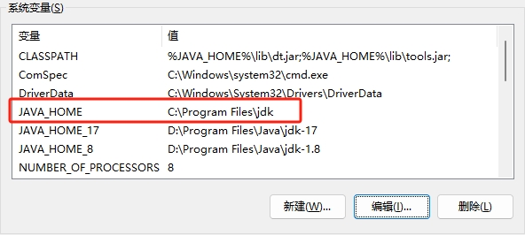
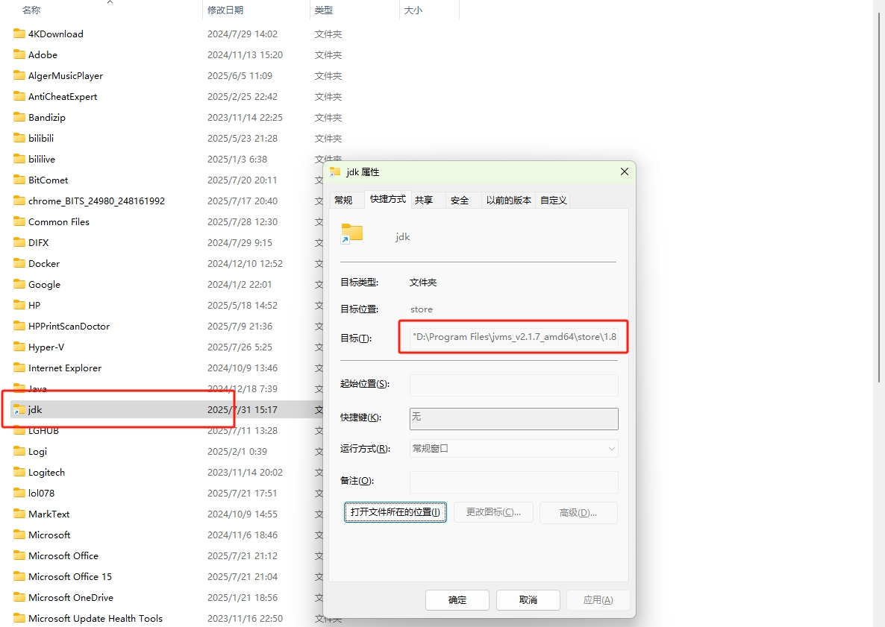
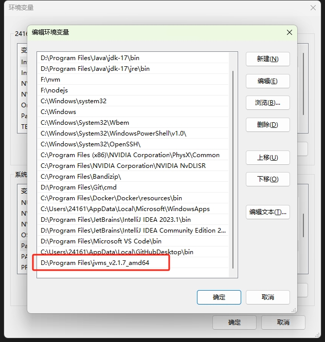

不同项目依赖不同 JDK 版本：旧项目可能基于 JDK 8 开发，而新项目可能使用 JDK 11/17/21 的新特性。多版本 JDK 可避免因版本不匹配导致的编译或运行时错误。

像 Maven 或 Gradle 这样的构建工具可能要求特定版本的 JDK。例如，Maven 在一些情况下可能需要 JDK 8，而 Gradle 可能要求更高版本的 JDK。

## 1. 使用 JVMS

GitHub：[JDK Version Manager (JVMS) for Windows（Windows JDK 版本管理器 ）](https://github.com/ystyle/jvms)

### 初始化

[下载文件](https://github.com/ystyle/jvms/releases)，例如 jvms_v2.1.7_amd64.zip，
右键，解压到 jvms_v2.1.7_amd64（压缩包内只有一个  `jvms.exe` 文件）。  
将 jvms_v2.1.7_amd64 文件夹复制到希望存放的位置，以 `D:\Program Files\jvms_v2.1.7_amd64` 为例。

- 以管理员身份打开终端（cmd 或 powershell）。

必须是管理员，因为接下来要创建 symlink（符号链接），否则会失败！

- 进入 `jvms.exe` 所在目录。

``` powershell
D:
cd "Program Files\jvms_v2.1.7_amd64"
```

- 初始化
``` powershell
.\jvms.exe init
```

输出示例：

```
PS C:\Windows\system32> D:
PS D:\> cd "Program Files\jvms_v2.1.7_amd64"
PS D:\Program Files\jvms_v2.1.7_amd64> .\jvms.exe init
set `JAVA_HOME` Environment variable to  C:\Program Files\jdk
add jvms.exe to `path` Environment variable
PS D:\Program Files\jvms_v2.1.7_amd64>
``` 

<mark>
   set `JAVA_HOME` Environment variable to  C:\Program Files\jdk  <br>
   add jvms.exe to `path` Environment variable
</mark>

这一步会：

- **设置 JAVA_HOME 环境变量**：创建一个（或覆盖）名为 `JAVA_HOME`， 值为 `C:\Program Files\jdk` 的系统环境变量。



- 在 `C:\Program Files` 文件夹下会生成一个 `jdk` 的快捷方式（映射到实际使用版本的文件位置），后续切换会改变目标值。



- **将 jvms.exe 添加到 PATH**：在 Path 系统变量内追加一个 `D:\Program Files\jvms_v2.1.7_amd64`。



### 安装和切换 JDK

再次以管理员身份打开终端。

- 使用 help 命令查看使用方法。

```
PS C:\Windows\system32> jvms -h
NAME:
   jvms - JDK Version Manager (JVMS) for Windows

USAGE:
   jvms.exe [global options] command [command options] [arguments...]

VERSION:
   v2.1.7

COMMANDS:
     init        Initialize config file
     list, ls    List current JDK installations.
     install, i  Install available remote jdk
     switch, s   Switch to use the specified version or index number.
     remove, rm  Remove a specific version.
     rls         Show a list of versions available for download.
     proxy       Set a proxy to use for downloads.
     help, h     Shows a list of commands or help for one command

GLOBAL OPTIONS:
   --help, -h     show help
   --version, -v  print the version
PS C:\Windows\system32>
```

- 查看可用版本。

``` powershell
jvms rls
```

查看所有可用版本。

``` powershell
jvms rls -a
```

输出示例：

```
PS C:\Windows\system32> jvms rls
    1) 21.0.4
    2) 20.0.0
    3) 17.0.6
    4) amazon_jdk17.0.6
    5) 11.0.8
    6) amazon_jdk11.0.13_8
    7) 1.8.0_151
    8) amazon_jdk1.8.0_265
    9) amazon_jdk1.8.0_222_x86
    10) 1.8.0_74_x86

use "jvms rls -a" show all the versions

For a complete list, visit https://raw.githubusercontent.com/ystyle/jvms/new/jdkdlindex.json
```

- 安装指定版本 jdk。

``` powershell
jvms install 1.8.0_151
```

输出示例：

```
PS C:\Windows\system32> jvms install 1.8.0_151
Downloading jdk version 1.8.0_151...
 185.90 MB / 185.90 MB [=================================] 100.00% 18.97 MB/s 9s
Complete
Installing JDK 1.8.0_151 ...
Installation complete. If you want to use this version, type
```

文件会下载至 `D:\Program Files\jvms_v2.1.7_amd64\store`（添加本地 jdk，也将文件放到这）。

- 切换 JDK 版本至 1.8.0_151。

```
jvms switch 1.8.0_151
```

- 查看当前版本。

```
java -version
```

输出示例：

```
PS C:\Windows\system32> jvms switch 1.8.0_151
Switch success.
Now using JDK 1.8.0_151
PS C:\Windows\system32> java -version
java version "1.8.0_151"
Java(TM) SE Runtime Environment (build 1.8.0_151-b12)
Java HotSpot(TM) 64-Bit Server VM (build 25.151-b12, mixed mode)
PS C:\Windows\system32>
```

## 2. GUI

文件路径示例：  
``` bash
└─ D:\Program Files\Java
   ├─ jdk-1.8
   └─ jdk-17
```

使用 **jdk1.8**，把 `JAVA_HOME` 改为 `%JAVA_HOME_8%` 。使用 **jdk17** ，把 `JAVA_HOME` 改为 `%JAVA_HOME_17%` 即可。

在搜索栏（Win + S）中搜索 **编辑系统环境变量**。

### 配置 JAVA_HOME

默认指向 JDK 17。

| 变量名        | 变量值                         |
|---------------|--------------------------------|
| JAVA_HOME_8   | D:\Program Files\Java\jdk-1.8 |
| JAVA_HOME_17  | D:\Program Files\Java\jdk-17  |
| JAVA_HOME     | %JAVA_HOME_17%                |


### 配置 Path

追加 `%JAVA_HOME%\bin;%JAVA_HOME%\jre\bin;` 。

- %JAVA_HOME%\bin
- %JAVA_HOME%\jre\bin

### 配置 CLASSPATH

以分号 `;` 分隔路径，包含 `.`（当前目录）：`.;%JAVA_HOME%\lib\dt.jar;%JAVA_HOME%\lib\tools.jar;`

``` powershell
.;%JAVA_HOME%\lib\dt.jar;%JAVA_HOME%\lib\tools.jar;
```

最后运行 `java -version` 。

## 3. 命令行

### setx 命令介绍

setx 是 Windows 下的一个命令行工具，用于设置用户级或系统级环境变量。它与 set 命令不同，setx 创建的环境变量是永久性的，即使重新启动计算机也会保留。

setx 的变量值长度限制为 1024 个字符。如果 Path 太长，可能需要通过 GUI 手动编辑。

``` powershell
setx [变量名] [变量值] [/M]
```

- **变量名**：你想设置的环境变量的名称。
- **变量值**：环境变量的值（例如路径或配置字符串）。
- **/M**：将环境变量设置为系统级变量。如果省略此选项，则仅设置为当前用户的变量。

#### 查看环境变量值

setx 不支持直接查看环境变量值，可以使用以下命令查看：**echo %变量名%**，例如：`echo %JAVA_HOME%` 。

### 设置 JAVA_HOME

#### JAVA_HOME_8

``` powershell
setx JAVA_HOME_8 "D:\Program Files\Java\jdk-1.8" /M
```

#### JAVA_HOME_17

``` powershell
setx JAVA_HOME_17 "D:\Program Files\Java\jdk-17" /M
```

#### JAVA_HOME  

默认指向 JDK 17。

``` powershell
setx JAVA_HOME "%JAVA_HOME_17%" /M
```

``` powershell
echo %JAVA_HOME%
```

### 更新 Path

#### 获取当前 Path 值

``` powershell
echo %Path%
```

在更新 Path 之前，先获取当前的 Path 值，将输出的内容复制并保存，作为备份。

#### 追加路径

使用 %Path% 引用现有值，并将新路径 `%JAVA_HOME%\bin;%JAVA_HOME%\jre\bin;` 追加到末尾：

``` powershell
setx Path "%Path%;%JAVA_HOME%\bin;%JAVA_HOME%\jre\bin;" /M
```

重新打开一个命令提示符窗口，运行 `echo %Path%` 命令验证更新是否成功。


### 设置 CLASSPATH

``` powershell
setx CLASSPATH ".;%JAVA_HOME%\lib\dt.jar;%JAVA_HOME%\lib\tools.jar" /M
```

``` powershell
echo %CLASSPATH%
```

## 4. 问题排查

如切换未生效，尝试以下操作：

1. 删除 **C:\Windows\System32** 目录下的 `java.exe`、`javax.exe` 或 `javac.exe` 。

2. 删除 **C:\Program Files (x86)\Common Files\Oracle\Java\javapath** 和 **C:\ProgramData\Oracle\Java\javapath** 。
   - 搜索 `javapath` 删除相关文件夹。
   - 删除带 `javapath` 的 Path 环境变量。

3. 从注册表中（windows +R 输入 regedit）删除在 **HKEY_LOCAL_MACHINE\SOFTWARE\JavaSoft** 下的： 
   - `Java Development Kit` 的 `CurrentVersion` 项的值，
   - 和 `Java Runtime Environment` 的 `CurrentVersion` 项的值。
