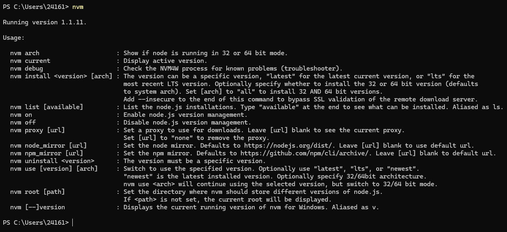
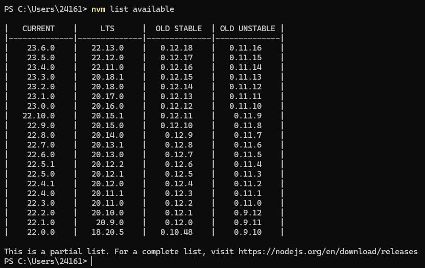
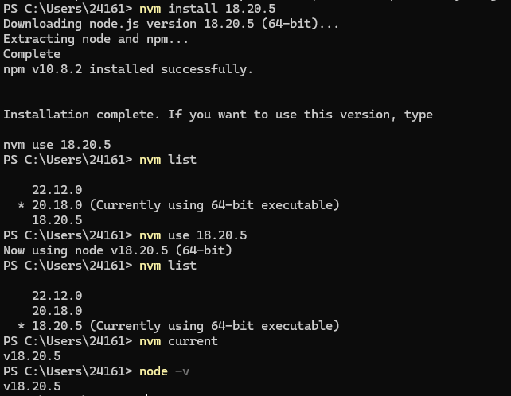

## 什么是 NVM

Node Version Manager (NVM)：即 Node 版本管理器，是一个 Node 版本管理工具，使用 NVM 可以更灵活地管理不同版本的 Node.js。

NVM 允许安装不同版本的 Node，并根据正在处理的项目（不同项目中需要不同版本的 Node.js），通过命令行在这些版本之间切换。

## 下载 NVM for Windows

NVM for Windows（nvm-windows）是Windows 平台上用于管理 Node.js 版本的工具。  
NVM for Windows 是一个命令行工具。  
NVM for Windows（nvm-windows）是由 Go 编写的。  

GitHub：[nvm-windows](https://github.com/coreybutler/nvm-windows)

下载：[Releases · nvm-windows](https://github.com/coreybutler/nvm-windows/releases)

## 卸载之前的

官方建议：为了使安装更简单，在安装 NVM for Windows 之前卸载设备上现有的 Node.js，删除任何残留文件。

⭐ ⭐ **Uninstall any pre-existing Node installations!!** ⭐ ⭐

::: info README
The simplest (recommended) way to get NVM for Windows running properly is to uninstall any prior Node installation before installing NVM for Windows.  

For simpliciy, we recommend uninstalling any existing versions of Node.js before using NVM for Windows. **Delete any existing Node.js installation directories** (e.g., %ProgramFiles%\nodejs) that might remain. NVM's generated symlink will not overwrite an existing (even empty) installation directory.
:::

没有卸载（或完全卸载）可能遇到以下问题：

- **权限问题**  
  出于安全原因，Windows 不允许一个厂商的应用程序卸载另一个厂商的应用程序。  
  官方的 NVM4W 安装程序会尝试接管现有的 Node.js 安装（具体过程会受到运行安装程序的用户权限的影响），但无法实际卸载原有的 Node.js 版本。  
  为了解决这个问题，NVM for Windows 安装程序会尝试将原有 Node.js 安装文件复制到 NVM 根目录中，包括全局的 npm 模块和配置。一旦此过程完成，可以卸载原来的 Node.js 安装，而不会丢失数据。

- **路径安装问题**  
  如果尝试将 NVM_SYMLINK 配置为使用一个现有目录（例如 C:\Program Files\nodejs），会失败，因为符号链接无法覆盖物理目录。
  如果选择一个不同的符号链接路径（例如 C:\nvm\node），则不会出现此问题。

- **路径冲突**  
  如果没有卸载原始版本，运行 `nvm use` 可能看起来毫无效果。而运行 `node -v` 时，总是显示原始安装版本的 Node.js。这是由于路径（PATH）冲突导致的，当同一个应用程序被多次安装时，路径优先级可能出现问题。  
  在 NVM4W 1.1.11+ 版本中，可以运行 `nvm debug` 来确定是否存在路径冲突。

### 1. 卸载 Node.js

卸载之前可以使用 `where node` 命令查找 Node.js 可执行文件的位置（此命令会输出系统 PATH 环境变量中找到的所有 node 可执行文件的路径）。

以 Window 11 为例：  
进入 **设置 -> 应用 -> 安装的应用** ，找到 Node.js，点击右侧的更多选项（···），选择卸载。  
或  
打开 **控制面板 > 程序和功能**，找到 Node.js，右键选择 卸载。  

### 2. 删除残留文件

删除以下目录中的文件（如果存在）：

- **C:\User\ \<username>** 文件夹下的：
  - `.npmrc`、`.yarnrc` 或 `.node_repl_history` 文件。  
  - C:\Users\\<username\>\AppData\Roaming\npm
  - C:\Users\\<username\>\AppData\Roaming\npm-cache
  - C:\Users\\<username\>\AppData\Local\npm-cache
- **Program Files** 文件夹或 **Program Files (x86)** 文件夹下的 **Nodejs** 文件夹。
  - 例如 `C:\Program Files (x86)\Nodejs` 和 `C:\Program Files\Nodejs` 。

也可以使用 Everything 全局搜索 npm 或 node 。

### 3. 移除环境变量

在搜索栏中搜索 **编辑系统环境变量**，删除 node 相关的环境变量。

### 4. 检查卸载

``` bash
node -v
npm -v
```

## 安装和升级

### 安装

卸载之前的 node 后，选择 **以管理员身份运行** 的方式，运行 nvm-setup.exe 。

**完成安装向导**：

- 1.勾选接受协议（I accept the agreement） 。

- 2.选择 nvm 安装路径。  

安装程序使用的默认目录是`C:\Users\<username>\AppData\Roaming\nvm`，你也可以选择其他的目录（但尽量避免使用中文目录）。

- 3.选择 nodejs（Node.js Symlink）路径。

这个目录不应该存在（无需自己创建），它将由 NVM 自动创建和维护。 NVM 生成的符号链接无法覆盖现有的（即使是空的）安装目录。

- 4.点击 Install 按钮开始安装。

安装完成后即可使用。

### 确认安装成功

在 CMD 或 PowerShell 中运行 `nvm` 会显示帮助菜单。



但这并不是真正意义上的安装成功，能切换成功才算。

未完全卸载会导致切换无效（使用指定版本：nvm use 失败），切换操作参考 [简单使用](#简单使用) 部分。

如果真的遇到切换失败的问题，可查看 **# 卸载之前的** 中的**路径冲突**部分。

### 升级

::: info Note
💡 As of v1.1.8, there is an upgrade utility that will automate the upgrade process.  
**To upgrade nvm-windows**, run the new installer. It will safely overwrite the files it needs to update without touching your node.js installations. **Make sure you use the same installation and symlink folder**. If you originally installed to the default locations, you just need to click "next" on each window until it finishes.
:::  

v1.1.8 + ，运行新的安装程序进行覆盖即可，注意使用和之前相同的两个目录。

## 常用命令

NVM for Windows（nvm-windows）需要在具有管理员权限的命令提示符或 PowerShell 中运行。

- **nvm list 或 nvm ls**：列出所有已安装的 Node.js 版本。
- **nvm list available**：显示所有可安装的版本。
- **nvm install \<version\>**：安装指定版本的 Node.js。  
  可以安装任何有效的 Node.js 版本，甚至包括 LTS（长期支持）版本或最新版本。
- **nvm uninstall \<version\>**：卸载指定版本的 Node.js。
- **nvm use \<version\>**：切换到指定版本的 Node.js。
- **nvm current**：显示当前正在使用的 Node.js 版本。

## 使用

### 设置镜像

``` powershell
nvm node_mirror https://npmmirror.com/mirrors/node/
nvm npm_mirror https://npmmirror.com/mirrors/npm/
```

这些配置会保存在安装目录下的 settings.txt 文件中。

- root：这是提取文件的安装目录（NVM_HOME）。
- path：这是 NVM_SYMLINK 中定义的符号链接目录。

### 简单使用

::: info Note
NVM for Windows 使用 `mklink` 命令，更新符号链接（symlink）来切换 node.js 版本。符号链接会被重新创建，以指向应运行的 node.js 版本。此过程需要更高的管理权限。
:::

**mklink 命令**：是 Windows 中用来创建符号链接（symlink）的命令。符号链接是一种特殊类型的文件，它指向另一个文件或目录，就像是一个快捷方式。mklink 可以帮助你在文件系统中创建指向其他位置的快捷方式。

**为了创建/修改符号链接，必须以管理员身份运行。**

当然，“必须以管理员身份运行” 是官方建议的，我尝试使用普通用户切换时（`nvm use version`）也是能成功的，但是需要弹窗确认（必须选择是）。

证书是有过期时间的，听劝。

::: warning 弹窗内容
**用户账户控制**  
**你要允许此应用对你的设备进行更改吗？**  
**Windows Command Processor**  
显示更多详细信息  ⬇️  

已验证的发布者：MicroSoft Windows  
程序位置：`"C:\Windows\SysWOW64\cmd.exe"/C mkink /D F:\nodejs F:\nvm\v18.20.5`  
显示发布者的证书信息  
选择何时显示更改通知
:::

#### 1. 查看可用版本

``` powershell
nvm list available
```



This is a partial list. For a complete list, visit [https://nodejs.org/en/download/releases](https://nodejs.org/en/download/releases).

[Looking for the latest release of a version branch?](https://nodejs.org/en/about/previous-releases#looking-for-the-latest-release-of-a-version-branch)

#### 2. 下载指定版本

选择一个 LTS（长期支持）版本，进行下载。

``` powershell
nvm install 18.20.5
```

#### 3. 查看已安装版本

带星号的就是当前使用的版本，也可以使用 `nvm current` 或 `node -v` 查看当前使用版本。

``` powershell
nvm-list
```

#### 4. 切换版本

``` powershell
nvm use 18.20.5
```



## 卸载

找到安装目录下的 `unins000.exe`，双击，确认。

如果没有这个文件，手动卸载：
- 删除安装目录 (NVM_HOME)。
- 删除符号链接目录 (NVM_SYMLINK)，至少安装了一个 Node 版本时才有。
- 删除环境变量（`NVM_HOME` 和 `NVM_SYMLINK`）。
- 如果添加了注册表值，则应将其删除。

## 参考链接

[Node 版本管理器](https://nvm.p6p.net/)  
[Manual Installation](https://github.com/coreybutler/nvm-windows/wiki#manual-installation)