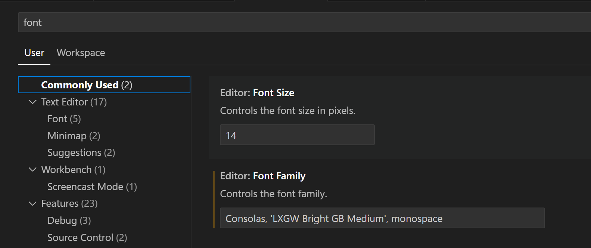

VSCode（Visual Studio Code）

## 大小写转换

### Text Edits

**To Lower Case**：Shift + Alt + L  
**To Upper Case**：Shift + Alt + U  
**Remove Whitespace**：Shift + Alt + W  

### 自定义快捷键

**首选项（Preference）-> 键盘快捷方式（Keyboard Shortcuts）**

搜索 "转换为大写/转换为小写"，或者 "upper/lower"

