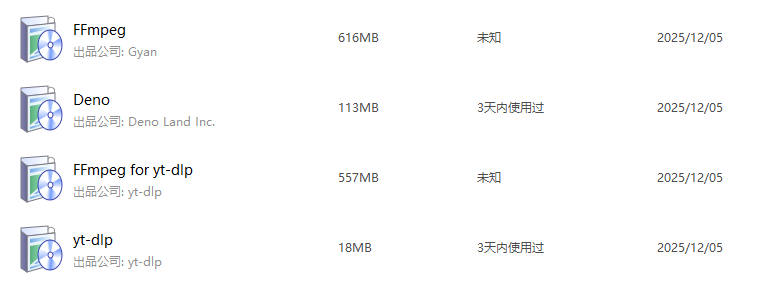
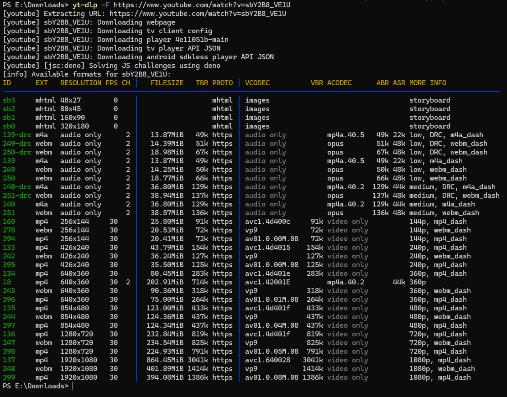
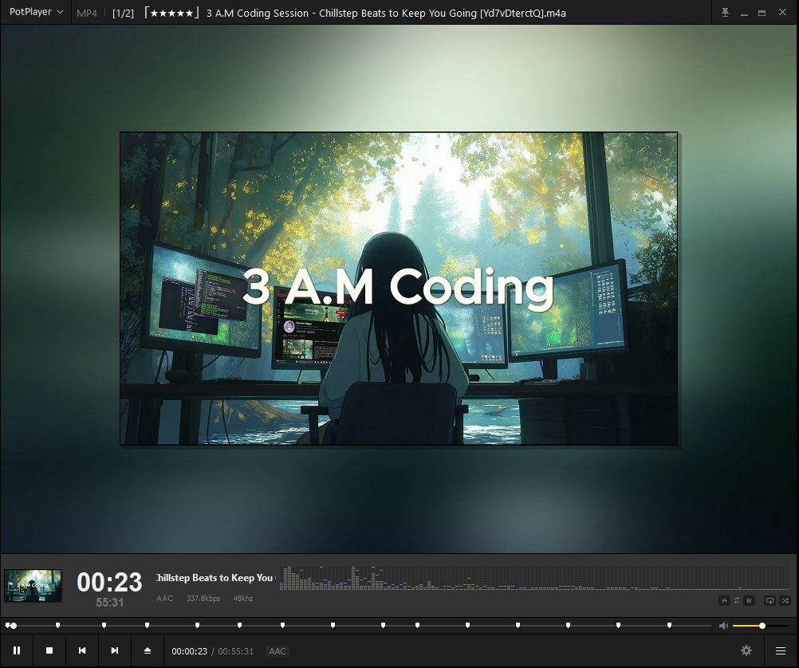
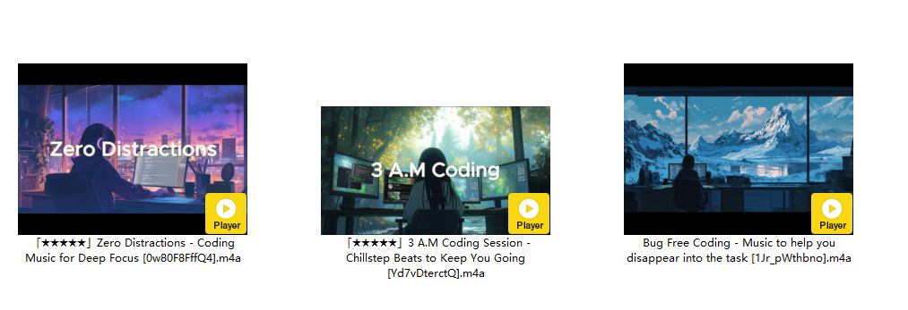
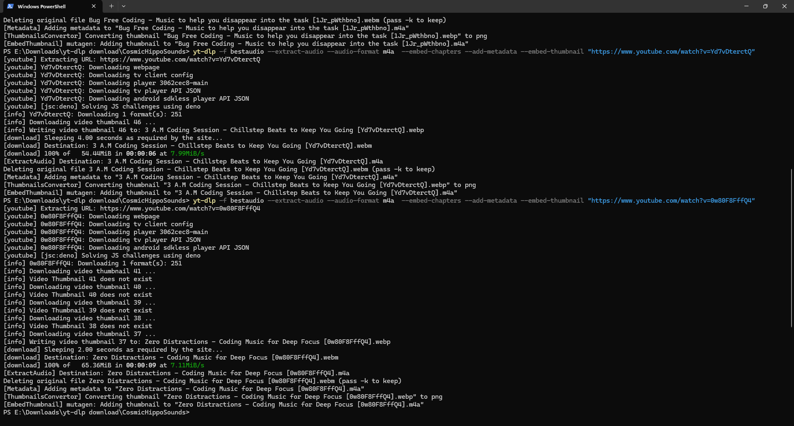
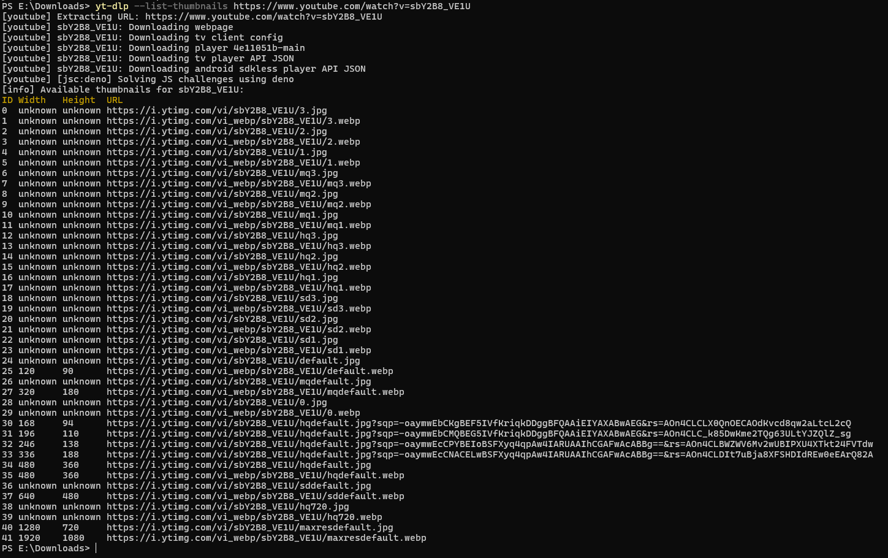

## yt-dlp 与 ffmpeg

[yt-dlp](https://github.com/yt-dlp/yt-dlp) 是一款功能丰富的命令行音频/视频下载器,支持数千个网站。
该项目是 youtube-dl 的一个分支,基于现已停止维护的 youtube-dlc。

[FFmpeg](https://www.gyan.dev/ffmpeg/builds/) 是领先的多媒体框架,能够解码、编码、转码、复用、解复用、流式传输、过滤和播放人类和机器创建的几乎所有内容。它支持从最晦涩的古老格式到最前沿的格式。FFmpeg 64 位静态完整版本来自 www.gyan.dev。包含大多数库。

以上信息来自 `winget show yt-dlp` 、`winget show ffmpeg` 。

## 安装

[Installation · yt-dlp/yt-dlp Wiki](https://github.com/yt-dlp/yt-dlp/wiki/Installation)

Windows [WinGet](https://github.com/yt-dlp/yt-dlp/wiki/Installation#winget) 安装

自动安装到 WinGet 缓存目录。

```bash
winget install yt-dlp
```

To update, run:

```bash
winget upgrade yt-dlp
```

部分输出信息：

```
正在安装依赖项:
此包需要以下依赖项：
  - 程序包
      DenoLand.Deno
      yt-dlp.FFmpeg

添加了命令行别名： "yt-dlp"
已修改路径环境变量；重启 shell 以使用新值。
```

### 查看版本

查看版本，验证是否安装成功。

```powershell
yt-dlp --version

ffmpeg -version
```

输出示例：

```powershell
PS C:\Users\24161> yt-dlp --version
2025.11.12

PS C:\Users\24161> ffmpeg -version
ffmpeg version N-121583-g4348bde2d2-20251031 Copyright (c) 2000-2025 the FFmpeg developers
built with gcc 15.2.0 (crosstool-NG 1.28.0.1_403899e)
configuration: --prefix=/ffbuild/prefix ... --extra-version=20251031
libavutil      60. 16.100 / 60. 16.100
libavcodec     62. 17.100 / 62. 17.100
libavformat    62.  6.101 / 62.  6.101
libavdevice    62.  2.100 / 62.  2.100
libavfilter    11.  9.100 / 11.  9.100
libswscale      9.  3.100 /  9.  3.100
libswresample   6.  2.100 /  6.  2.100

Exiting with exit code 0
PS C:\Users\24161>
```



## 基本使用

### 下载视频

默认最高质量。

```bash
yt-dlp "https://www.youtube.com/watch?v=xxxxxx"
```

## 下载

`https://www.youtube.com/watch?v=${VIDEO_ID}`

如果你想列出可用的下载格式（formats）而不实际下载，可以使用 -F 或 --list-formats 参数。

```bash
yt-dlp -F <视频URL>

yt-dlp -F https://www.youtube.com/watch?v=sbY2B8_VE1U
```









```powershell
PS E:\Downloads\yt-dlp download\CosmicHippoSounds> yt-dlp -f bestaudio --extract-audio --audio-format m4a  --embed-chapters --add-metadata --embed-thumbnail "https://www.youtube.com/watch?v=Yd7vDterctQ"
[youtube] Extracting URL: https://www.youtube.com/watch?v=Yd7vDterctQ
[youtube] Yd7vDterctQ: Downloading webpage
[youtube] Yd7vDterctQ: Downloading tv client config
[youtube] Yd7vDterctQ: Downloading player 3062cec8-main
[youtube] Yd7vDterctQ: Downloading tv player API JSON
[youtube] Yd7vDterctQ: Downloading android sdkless player API JSON
[youtube] [jsc:deno] Solving JS challenges using deno
[info] Yd7vDterctQ: Downloading 1 format(s): 251
[info] Downloading video thumbnail 46 ...
[info] Writing video thumbnail 46 to: 3 A.M Coding Session - Chillstep Beats to Keep You Going [Yd7vDterctQ].webp
[download] Sleeping 4.00 seconds as required by the site...
[download] Destination: 3 A.M Coding Session - Chillstep Beats to Keep You Going [Yd7vDterctQ].webm
[download] 100% of   54.44MiB in 00:00:06 at 7.99MiB/s
[ExtractAudio] Destination: 3 A.M Coding Session - Chillstep Beats to Keep You Going [Yd7vDterctQ].m4a
Deleting original file 3 A.M Coding Session - Chillstep Beats to Keep You Going [Yd7vDterctQ].webm (pass -k to keep)
[Metadata] Adding metadata to "3 A.M Coding Session - Chillstep Beats to Keep You Going [Yd7vDterctQ].m4a"
[ThumbnailsConvertor] Converting thumbnail "3 A.M Coding Session - Chillstep Beats to Keep You Going [Yd7vDterctQ].webp" to png
[EmbedThumbnail] mutagen: Adding thumbnail to "3 A.M Coding Session - Chillstep Beats to Keep You Going [Yd7vDterctQ].m4a"

PS E:\Downloads\yt-dlp download\CosmicHippoSounds> yt-dlp -f bestaudio --extract-audio --audio-format m4a  --embed-chapters --add-metadata --embed-thumbnail "https://www.youtube.com/watch?v=0w80F8FffQ4"
[youtube] Extracting URL: https://www.youtube.com/watch?v=0w80F8FffQ4
[youtube] 0w80F8FffQ4: Downloading webpage
[youtube] 0w80F8FffQ4: Downloading tv client config
[youtube] 0w80F8FffQ4: Downloading player 3062cec8-main
[youtube] 0w80F8FffQ4: Downloading tv player API JSON
[youtube] 0w80F8FffQ4: Downloading android sdkless player API JSON
[youtube] [jsc:deno] Solving JS challenges using deno
[info] 0w80F8FffQ4: Downloading 1 format(s): 251
[info] Downloading video thumbnail 41 ...
[info] Video Thumbnail 41 does not exist
[info] Downloading video thumbnail 40 ...
[info] Video Thumbnail 40 does not exist
[info] Downloading video thumbnail 39 ...
[info] Video Thumbnail 39 does not exist
[info] Downloading video thumbnail 38 ...
[info] Video Thumbnail 38 does not exist
[info] Downloading video thumbnail 37 ...
[info] Writing video thumbnail 37 to: Zero Distractions - Coding Music for Deep Focus [0w80F8FffQ4].webp
[download] Sleeping 2.00 seconds as required by the site...
[download] Destination: Zero Distractions - Coding Music for Deep Focus [0w80F8FffQ4].webm
[download] 100% of   65.36MiB in 00:00:09 at 7.11MiB/s
[ExtractAudio] Destination: Zero Distractions - Coding Music for Deep Focus [0w80F8FffQ4].m4a
Deleting original file Zero Distractions - Coding Music for Deep Focus [0w80F8FffQ4].webm (pass -k to keep)
[Metadata] Adding metadata to "Zero Distractions - Coding Music for Deep Focus [0w80F8FffQ4].m4a"
[ThumbnailsConvertor] Converting thumbnail "Zero Distractions - Coding Music for Deep Focus [0w80F8FffQ4].webp" to png
[EmbedThumbnail] mutagen: Adding thumbnail to "Zero Distractions - Coding Music for Deep Focus [0w80F8FffQ4].m4a"
PS E:\Downloads\yt-dlp download\CosmicHippoSounds>
```

## 批量下载

## 合集下载

注意：合集（Playlist）`Private` 需修改为 `Public`，否则会出现 `YouTube said: The playlist does not exist.` 问题。

```powershell
PS E:\Downloads> yt-dlp -f bestvideo+bestaudio/best --playlist-items 2-4 "https://www.youtube.com/watch?list=PLRXdN91j1lhjptWJ1cyMeCr3SG1ShRxkg"
[youtube:tab] Extracting URL: https://www.youtube.com/watch?list=PLRXdN91j1lhjptWJ1cyMeCr3SG1ShRxkg
WARNING: [youtube:tab] A video URL was given without video ID. Trying to download playlist PLRXdN91j1lhjptWJ1cyMeCr3SG1ShRxkg
[youtube:tab] Extracting URL: https://www.youtube.com/playlist?list=PLRXdN91j1lhjptWJ1cyMeCr3SG1ShRxkg
[youtube:tab] PLRXdN91j1lhjptWJ1cyMeCr3SG1ShRxkg: Downloading webpage
WARNING: [youtube:tab] YouTube said: The playlist does not exist.
ERROR: [youtube:tab] PLRXdN91j1lhjptWJ1cyMeCr3SG1ShRxkg: YouTube said: The playlist does not exist.
```

## 封面下载

分别下载 4:3 与 16:9 封面



## Help

```bash
yt-dlp --help
```

[使用方法和选项](https://github.com/yt-dlp/yt-dlp?tab=readme-ov-file#usage-and-options)

## 参考

- [yt-dlp 安裝教學 (Linux / Windows / macOS / Android / iOS)](https://ivonblog.com/posts/yt-dlp-installation/)
- [yt-dlp 指令使用教學，萬能 Youtube 影片命令行下載工具](https://ivonblog.com/posts/yt-dlp-usage/)
- [yt-dlp 工具常用方式](https://zhuanlan.zhihu.com/p/679989795)
