## 异常分类

Java 中的异常类继承自 `java.lang.Throwable` 类。
Throwable 有两个主要的子类：`Error` 和 `Exception` 。

**Error**：表示系统级的错误，这些错误通常是致命的，应用程序通常无法恢复。

**Exception**：表示应用程序级的异常，这些异常通常是可以被捕获并处理的。
Exception 类又进一步分为两类：`受检异常` 和 `非受检异常`。

**受检异常（Checked Exception）**：在编译时就必须被处理的异常。
如果方法可能会抛出受检异常，那么该方法必须在方法签名中使用`throws`关键字声明这些异常。
调用该方法的代码必须捕获这些异常，或者将它们继续向上层抛出。

**非受检异常（Unchecked Exception）**：包括运行时异常（`RuntimeException`及其子类）和错误（`Error`及其子类）。这些异常在编译时不需要被显式声明或捕获。

### Throwable

**《核心技术·卷Ⅰ》中的描述**：

> **P291**：在 Java 程序设计语言中，异常对象都是派生于 `Throwable` 类的一个类的实例。
> 如果 Java 中内置的异常类不能满足需求，用户还可以创建自己的异常类。  
> **P292**：所有的异常都是由 Throwable 继承而来，但在这个层次结构中。下一层立即分为两个分支：`Error` 和 `Exception` 。

**《码出高效》中的描述**：

> **P137**：Java 中定义了一套完整的异常机制，所有异常都是 Throwable 的子类，为 `Error`（致命异常）和 `Exception`（非致命异常）。

### Error

**《核心技术·卷Ⅰ》中的描述**：

> **P292**：Error 类层次结构描述了 **Java 运行时系统的内部错误和资源耗尽问题**。你不应该抛出这种类型的对象。
> 如果出现了这样的内部错误，除了通知用户，并尽力妥善地终止程序之外，你几乎无能为力。这种情况很少出现。

**《码出高效》中的描述**：

> **P137**：Error 是一种非常特殊的异常类型，它的出现标识着系统发生了不可控的错误，例如 `StackOverflowError` 和 `OutOfMemoryError` 。针对此类错误，程序无法处理，只能人工介入。

### Exception

**《核心技术·卷Ⅰ》中的描述**：

> **P292**：Exception 层次结构分为两个分支：继承自 RuntimeException 的异常、不继承自 RuntimeException 的异常。  
> **P293**：Java 语言规范将派生于 Error 类或 RuntimeException 类的所有异常称为非检查型（unchecked）异常，所有其他异常称为检查型（checked）异常。

**《码出高效》中的描述**：

> **P137**：Exception 又分为 `checked` 异常（受检异常）和 `unchecked` 异常（非受检异常）。  
> **checked 异常**是需要在代码中显式处理的异常，否则会编译出错。  
> 如果能自行处理则可以在当前方法中捕获异常；如果无法处理，则继续向调用方抛出异常对象。  
> 常见的 checked 异常包括 JDK 中定义的 SQLException、ClassNotFoundException 等。  
> **unchecked 异常**是运行时异常，他们都继承自 RuntimeException，不需要程序进行显式的捕捉和处理。

> **P137**：checked 异常可以进一步细分为两类：  
> - 无能为力、**引起注意型**：针对此类异常，程序无法处理，如字段超长等导致的 SQLException，即使做再多的重试对解决异常也是没有任何帮助的，一般处理此类异常的做法是完整的保存异常现场，供开发工程师介入解决。
> - 力所能及、**坦然处置型**：如发生未授权异常（UnAuthorizedException），程序可跳转至权限申请页面。

> **P137、P138**：unchecked 异常可以进一步细分为3类：
> - **可预测异常**（Predicted Exception）：常见的可预测异常包括 IndexOutOfBoundsException、NullPointerException 等。基于对代码的性能和稳定性要求，此类异常不应该被产生或者抛出，而应该提前做好边界检查、空指针判断等处理。显式的声明或者捕获此类异常会对程序的可读性恶化运行效率产生很大影响。
> - **需捕捉异常**（Caution Exception）：例如在使用 Dubbo 框架进行 RPC 调用时产生的远程服务超时异常 DubboTimeoutException。此类异常是客户端必须显示处理的异常，不能因服务端的异常导致客户端不可用，此时处理方案可以是重试或者降级处理等。
> - **可透出异常**（Ignored Exception）：主要是指框架或系统产生的且会自行处理的异常，而程序无需关心。例如针对 Spring 框架中抛出的 NoSuchRequestHandingMethodException 异常，Spring 框架会自己完成异常的处理，默认将自身抛出的异常自动映射到合适的状态码，比如启动防护机制跳转到 404 页面。

《码出高效》P138：图 5-1 异常分类结构

## 异常的处理方式

## 常见的异常

### Error

- **OutOfMemoryError**：表明 Java 堆内存不足，无法为对象分配内存空间。
这个错误通常发生在应用程序试图创建新的对象，但堆内存空间已经被完全占用时。
这可能是由于程序中存在内存泄漏、数据量超出了预期范围或 JVM 配置的内存参数不当等原因导致的。  

- **StackOverflowError**：当线程的堆栈大小超过了 JVM 设置的限制时，会抛出此错误。
这通常是由于程序中存在无限制的递归调用或递归深度过大导致的。

### 运行时异常（Unchecked Exception）

常见的运行时异常包括：

1. **NullPointerException**：当应用程序试图在需要对象的地方使用null时，会抛出此异常。例如，调用null对象的实例方法或访问null对象的字段时。
2. **ArithmeticException**：当出现异常的运算条件时，会抛出此异常。例如，整数除以零时。
3. **ClassCastException**：当试图将对象强制转换为不是实例的子类时，会抛出此异常。例如，将String类型的对象强制转换为Integer类型。
4. **ArrayIndexOutOfBoundsException**：当尝试访问数组的非法索引时，会抛出此异常。索引值为负或大于等于数组大小时，即为非法索引。

- NullPointerException(空指针异常)
- IllegalArgumentException(参数异常，比如方法入参类型错误)
- NumberFormatException（字符串转换为数字格式错误，IllegalArgumentException的子类）
- ArrayIndexOutOfBoundsException（数组越界异常）
- ClassCastException（类型转换异常）
- ArithmeticException（算术异常）
- SecurityException（安全异常，比如权限不够）
- UnsupportedOperationException(不支持的操作异常，比如重复创建同一用户)

### 编译期异常（Checked Exception）

常见的编译期异常包括：

1. **FileNotFoundException**：当试图打开指定路径名表示的文件失败时，会抛出此异常。
2. **ClassNotFoundException**：当试图加载某个类但找不到该类的定义时，会抛出此异常。
3. **SQLException**：当访问数据库时发生错误时，会抛出此异常。例如，SQL语句写错、访问的表不存在或连接数据库失败等。
4. **NoSuchFieldException**：当试图访问某个类或接口的某个字段，但该字段不存在时，会抛出此异常。
5. **NoSuchMethodException**：当试图调用某个类或接口的某个方法，但该方法不存在时，会抛出此异常。
6. **ParseException**：当试图解析某个字符串为特定格式（如日期、时间等）但解析失败时，会抛出此异常。

## 参考

- 《Java 核心技术 卷 Ⅰ 开发基础（原书第12版）》P290：第7章 异常、断言和日志
- 《Effective Java（原书第3版）》P208：第10章 异常
- 《码出高效：Java 开发手册》P136：第5章 异常与日志

## 相关面试题

### Exception 和 Error 有什么区别？ 

Exception 和 Error 都是 Throwable 类的子类。

Error 是指 Java 运行时系统的内部错误和资源耗尽问题。  
Error 表示系统级的错误，这些错误通常是致命的，应用程序通常无法恢复。  
例如 `OutOfMemoryError`（内存溢出）和 `StackOverflowError`、`NoClassDefFoundError`（类定义找不到）等。 

Exception 表示应用程序级的异常，这些异常通常是可以被捕获并处理的。

Exception 又分为 `受检异常`（编译期异常）和 `非受检异常`（运行时异常）。

---

### Checked Exception 和 Unchecked Exception 有什么区别？

`checked` 异常（受检异常）是需要在代码中显式处理的异常，否则会编译出错。

`unchecked` 异常（非受检异常）是运行时异常，不需要程序进行显式的捕获和处理。

运行时异常（RuntimeException 及其子类）和 错误（Error 及其子类）都属于 Unchecked Exception 。

---

### 运行时异常和编译时异常之间的区别是什么？

运行时异常通常是由于程序员的逻辑错误导致的，而编译期异常则是由于外部条件或资源问题导致的。

运行时异常：发生在程序运行期间，编译器不会强制要求捕获或声明它们，可以不用显式处理，可以选择使用 try-catch 捕获处理。

编译期异常：发生在编译阶段，编译器会强制要求捕获或声明这些异常，必须在代码中显式处理，使用 try-catch 捕获或者 throws 关键字声明抛出，否则程序将无法通过编译。  

---

### throw 和 throws 有什么区别？

> **《码出高效》P137、P138**：
> throw 是方法内部抛出具体异常类对象的关键词，而 throws 则用在方法签名上，表示调用者可以通过此方法声明向上抛出异常对象。
> 
> 如果异常在当前方法的处理能力范围之内且没有必要对外透出，那么就直接捕获异常并做相应处理；
> 否则向上抛出，由上层方法或者框架来处理。
> 
> 如果在方法内部处理异常，需要根据不同的业务场景进行定制处理，如重试、回滚等操作。
> 如果向上抛出异常，需要再异常对象中添加上下文参数、局部变量、运行环境等信息，这样有利于排查问题。

---

### Throwable 类常用方法有哪些？

### try-catch-finally 如何使用？

::: warning 注意
不要在 finally 语句块中使用 return! 当 try 语句和 finally 语句中都有 return 语句时，try 语句块中的 return 语句会被忽略。这是因为 try 语句中的 return 返回值会先被暂存在一个本地变量中，当执行到 finally 语句中的 return 之后，这个本地变量的值就变为了 finally 语句中的 return 返回值。
:::

### finally 中的代码一定会执行吗？

### 如何使用 try-with-resources 代替 try-catch-finally？

### 异常使用有哪些需要注意的地方？

《阿里巴巴 Java 开发手册》P56 2.1 异常处理